# Spring Tool Suite 설정

참고자료 - 코드로 배우는 스프링 웹 프로젝트 - 이하 `코배웹`

## macOS tomcat 설치

* `Homebrew` 를 이용하여 터미널에서 tomcat을 설치 할 수 있다.

* 먼저 brew 를 최신버전으로 업데이트 해준다

  

  

* 업데이트가 완료되면 tomcat을 search 한다.

  
  
* tomcat 9 버전 사용을 위해 tomcaat을 install 시킨다

  

* 설치완료

  

> tomcat 설치경로
>
> /usr/local/Cellar/
>
> 폴더에 tomcat 이름으로 설치됨.
>
> 

## tomcat 실행방법

* 아래 해당 경로로 들어간다

  

* `./catalina start` 명령어를 이용하여 톰캣을 실행할 수 있다.

  

* 실행후 웹에서 `http://localhost:8080` 을 접속하여 확인이가능하다.

  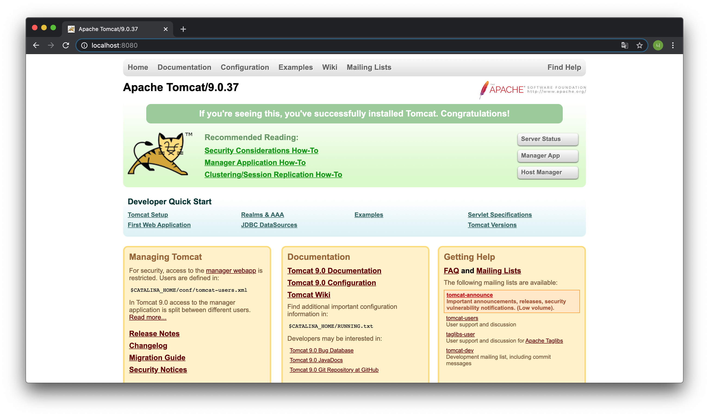

* 종료는 당연히 `./catalina stop` 명령어로 종료가 가능하다.

  


* 톰캣 설치 완료!!

## Legacy Project 생성하기

* STS 를 실행한 상태에서 Spring Legacy 프로젝트를 생성한다.

  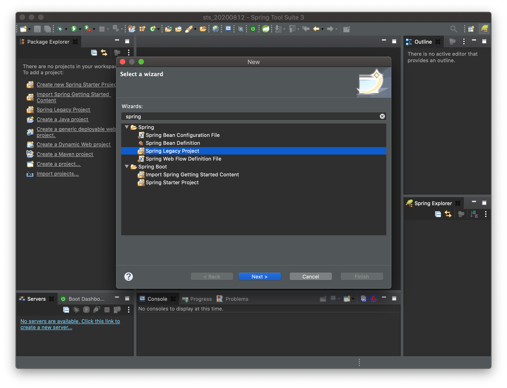

* Spring legacy Project는 maven 기반으로 스프링 프로젝트를 생성할 수 있다.

  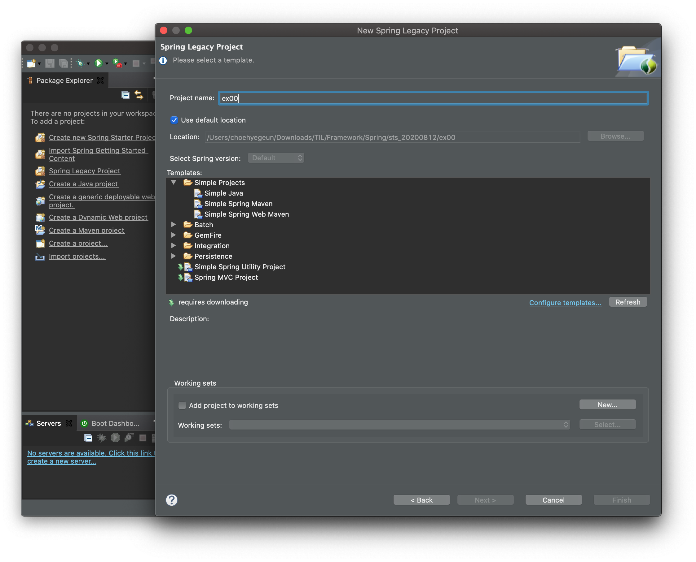

* 위에서 Spring MVC Project 로 프로잭트를 생성한다.

* 패키지 명은 꼭 3 Level로 생성한다.

  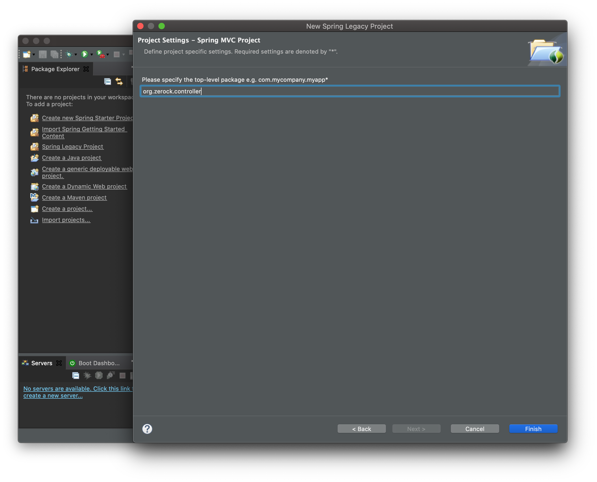

### porm.xml 설정 변경

* 스프링의 사용은 버전별로 약간씩 상이한 것이 있다.

* 해당 설정은 프로젝트 파일에 있는 porm.xml 파일을 통해 변경이 가능하다.

  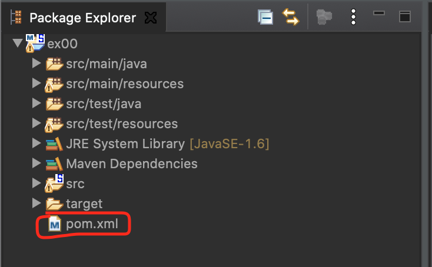

* 책의 예제를 따라가기 위해 먼저 스프링 프레임워크의 버전을 3.1.1 에서 5.0.7로 변경해 준다.

  

* 또한 첫 project 생성시 JRE의 버전은 1.6으로 생성이 된다. 스프링 5.x 버전을 이용하고 싶다면 1.8을 사용하는것이 가장 좋다고 한다. 해당설정을 1.8 버전으로 변경해 준다. 

  

  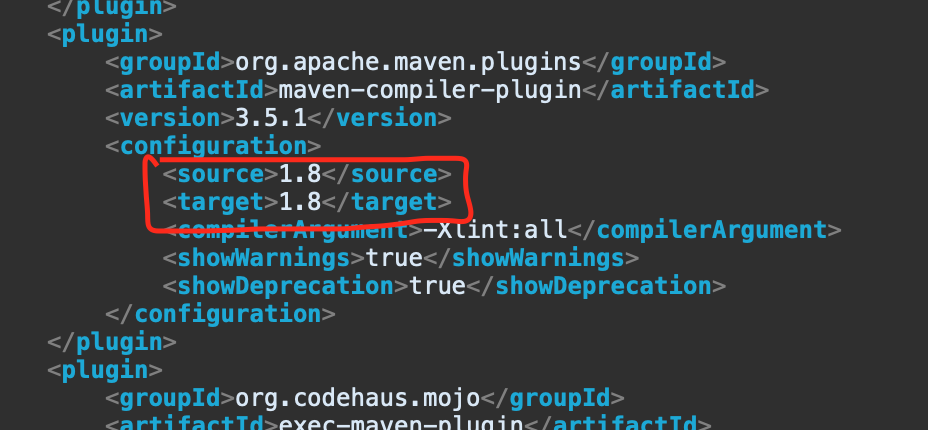

* 설정후 해당 xml을 저장하면 sts가 알아서 building을 진행해 준다.

  

* 혹여나 업데이트가 안된다면 프로젝트 오른쪽 클릭후 maven-Update Project 를 통해 업데이트 해준다

  


## tomcat 을 이용하여 프로젝트 실행하기

* 프로젝트를 오른쪽 클릭한 후 아래 목록으로 이동

  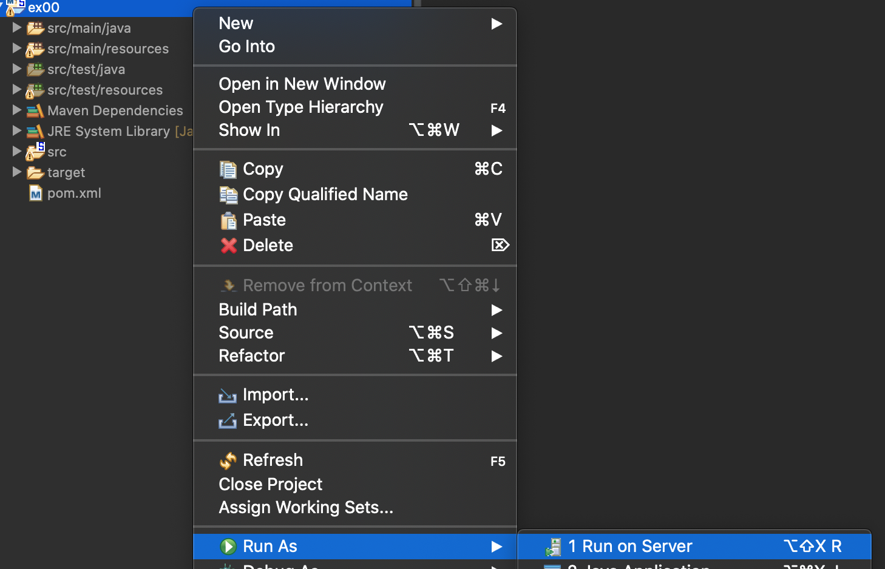

* 아래 창에서 위에서 설치한 tomcat 의 버전을 선택.

  

* 설정후 next를 하게되면 톰켓의 경로를 설정해야하는데 아래와 같이 경로를 지정한다.(톰켓 파일의 libexec 폴더로 지정)

  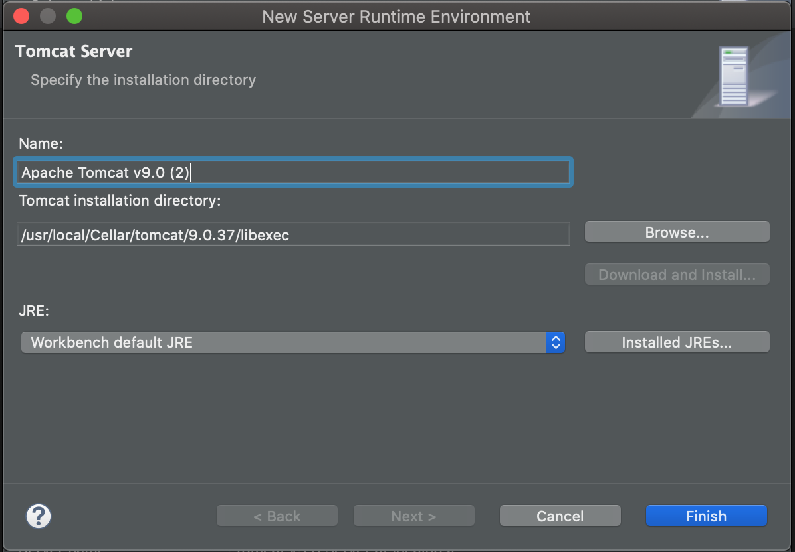

* 실행할 프로젝트를 선택후 Finish를 누르면 서버가 켜지면서 웹페이지가 두둥등장!

  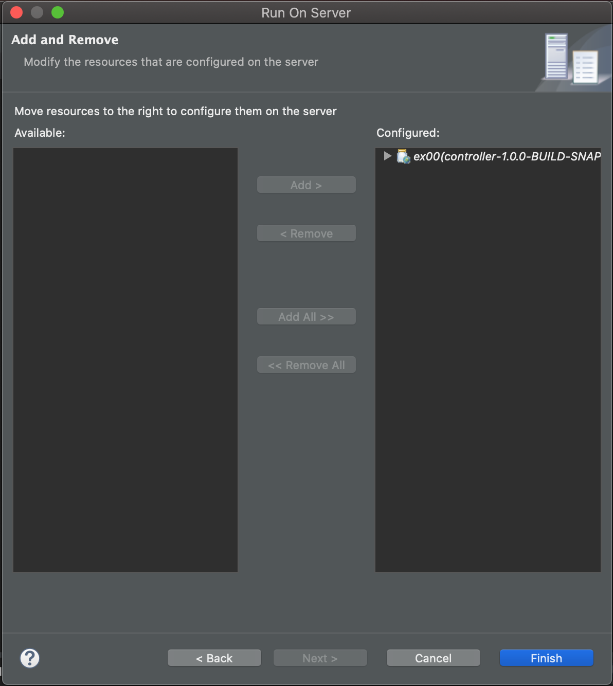

  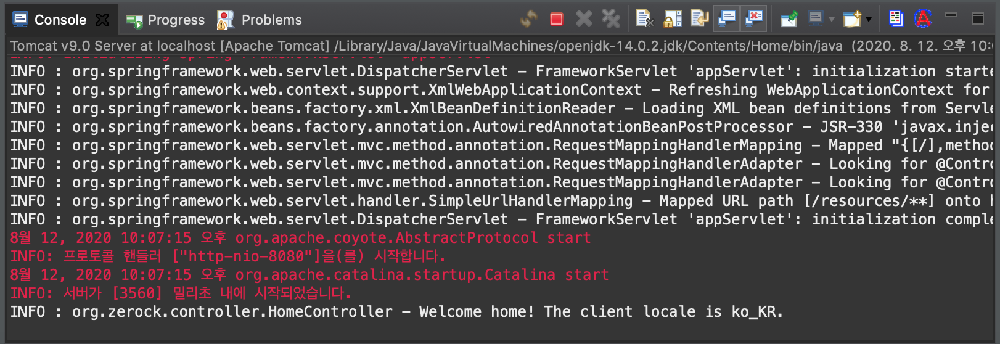

  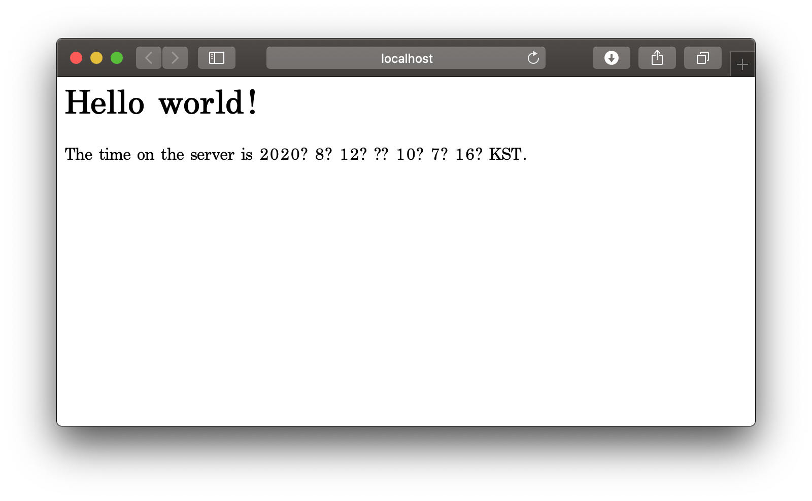

* 톰켓 설정 완료!!!!

## Lombok 라이브러리 설치

* Lombok 라이브러리를 이용하면 Java 개발 시 자주 사용하는 getter/setter, toString(), 생성자 등을 자동으로 생성해 주므로 약간의 코드만으로도 필요한 클래스를 설계할 수 있다고 한다. (`코배웹` 참고)

* Lombok 은 다른 jar파일들과 달리 Eclipse 에디터 내에서 사용되야 하기 때문에 maven으로 설치할 수 없다.

* [Lombok](https://projectlombok.org/download) 에 들어가 jar파일을 직접 다운로드 받는다. (2020.08.12 기준 버전 - 1.18.12)

  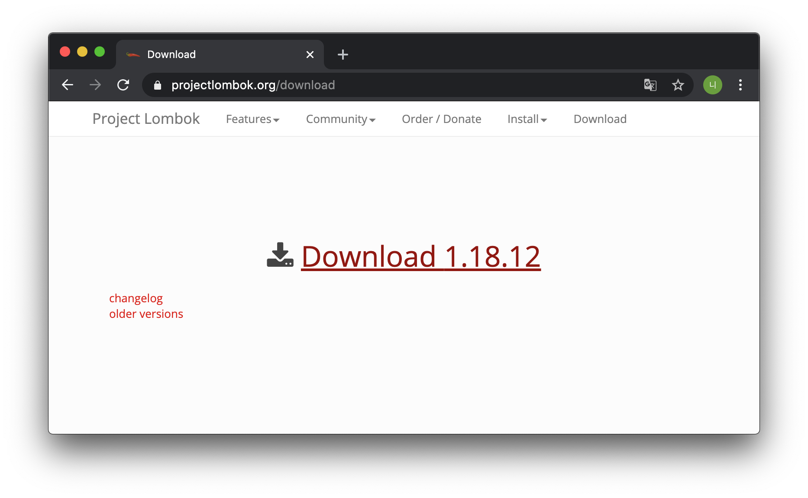

* 다운로드 후 cmd에서 lombok을 실행

  

  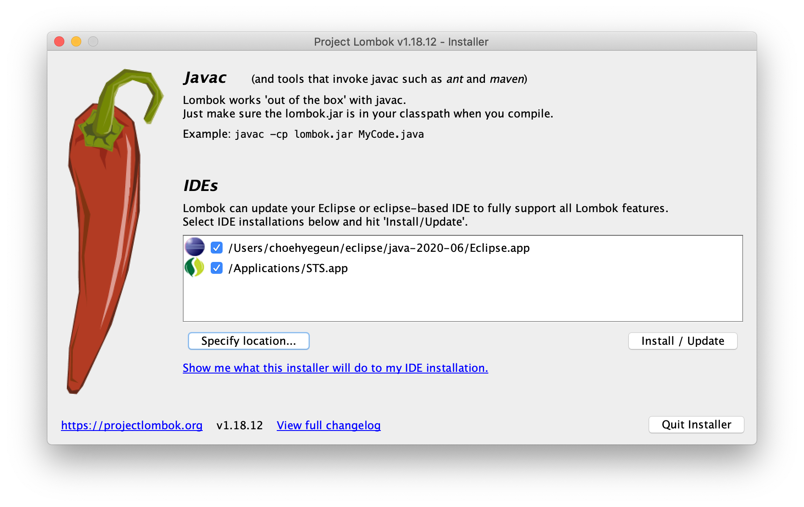

  <a name="solveProblemLombok">문제해결!</a>

  * 여기서 아무생각없이 install을 하였으나 그러면 안됨!

  * Specify location을 클릭한후 다음 경로에 있는 sts를 설정

    

    

  

  * 설치후 sts 재시작!

## Java Configuration

* 예전 스프링에서는 web.xml, context.xml등등 여러 xml 파일로 설정을 하였으나, 최근에는 xml과 별개로 Java를 이용하는 설정이 점점 증가하고 있다.

* 실제 스프링 레거시 Java Configuration을 위해 다음과 같은 작업이 진행한다.

  * `web.xml` 의 파일 사제 및 스프링 관련 파일 삭제

    * `web.xml, servlet-context.xml, root-context.xml` 3개 모두 삭제!

  * `porm.xml` 의 수정 및 스프링 버전 변경

    * 위 3개의 xml을 삭제하면 porm.xml에서 오류가 생김

    * 먼저 plugins 맨 하단에 아래 내용 추가

      ```xml
            <plugin>
      				<groupId>org.apache.maven.plugins</groupId>
      				<artifactId>maven-war-plugin</artifactId>
      				<version>3.2.0</version>
      				<configuration>
      					<failOnMissingWebXml>false</failOnMissingWebXml>
      				</configuration>
      			</plugin>
      ```

    * 이후 작성된 내용들 중 Java, Spring version 변경

      ```xml
      	<properties>
      		<java-version>1.8</java-version>
      		<org.springframework-version>5.0.7.RELEASE</org.springframework-version>
      ```

      ```xml
            <plugin>
      				<groupId>org.apache.maven.plugins</groupId>
      				<artifactId>maven-compiler-plugin</artifactId>
      				<version>2.5.1</version>
      				<configuration>
      					<source>1.8</source>
      					<target>1.8</target>
      					<compilerArgument>-Xlint:all</compilerArgument>
      					<showWarnings>true</showWarnings>
      					<showDeprecation>true</showDeprecation>
      				</configuration>
      			</plugin>
      ```

      

  * `Java` 설정 관련 패키지 생성

    * `@Configuration` 어노테이션을 이용하여 해당 클래스의 인스턴스를 이용해여 설정 파일을 대신함.

    * `src/main/java` 폴더에서 `org.zerock.config` 패키지 안에 `RootConfig.java` 생성.

      ```java
      package org.zerock.config;
      
      import org.springframework.context.annotation.Configuration;
      
      @Configuration
      public class RootConfig {
      	
      }
      
      ```

    * 그후 `web.xml` 을 대신하는 클래스로 `WebConfig.java` 클래스를 하나 생성한다. 해당 클래스는 `AbstractAnnotationConfigDispatcherServletInitializer` 를 상속받는다.

      ```java
      package org.zerock.config;
      
      import org.springframework.web.servlet.support.AbstractAnnotationConfigDispatcherServletInitializer;
      
      public class WebConfig extends AbstractAnnotationConfigDispatcherServletInitializer{
      
      	@Override
      	protected Class<?>[] getRootConfigClasses() {
      		// 이전에 작성한 RootConfig.java 파일을 Root로 사용하여 해당 클래스로 값을 반환.
      		return new Class[] {RootConfig.class};
      	}
      
      	@Override
      	protected Class<?>[] getServletConfigClasses() {
      		// TODO Auto-generated method stub
      		return null;
      	}
      
      	@Override
      	protected String[] getServletMappings() {
      		// TODO Auto-generated method stub
      		return null;
      	}
      
      }
      
      ```


# 의존성 주입 연습!

* 코배웹 예제!

* 먼저 사용될 두 VO(?) Data 를 생성!

* Chef.class

  ```java
  package org.zerock.sample;
  
  import org.springframework.stereotype.Component;
  
  import lombok.Data;
  
  @Component
  @Data
  public class Chef {
  
  }
  
  ```

* Restaurant.class

  ```java
  package org.zerock.sample;
  
  import org.springframework.beans.factory.annotation.Autowired;
  import org.springframework.stereotype.Component;
  
  import lombok.Data;
  import lombok.Setter;
  
  
  
  @Component
  @Data
  public class Restaurant{
  	
  	@Setter(onMethod_ = @Autowired)
  	private Chef chef;
  
  }
  ```

  * 해당 코드 작성하면서 onMethod_ 속성 사용에서 오류가 발생함. --> [해결 방안](#lombokError)

  

* 의존성 주입을 이용할 때 보통의 Spring의 경우 `root-context.xml` 을 이용하여 의존성을 설정하지만 요즘 추세로 Java Configuration 을 이용하기 위해 RootConfiguration class로 의존성 주입을 시도함.

* RootConfig.class

  ```java
  package org.zerock.config;
  
  import org.springframework.context.annotation.ComponentScan;
  import org.springframework.context.annotation.Configuration;
  
  @Configuration
  @ComponentScan(basePackages = {"org.zerock.sample"})
  public class RootConfig {
  	
  }
  ```

* 테스트 코드 작성!

  * 테스트는 Junit을 이용하여 로그를 확인하였다.
  * 여기서 또 문제 발생
    1. Log4j 어노테이션 오류가 발생함. - [해결 방안](#Log4jError)
    2. 위처럼 Java Configuration을 이용할 시 경로를 다르게 해야함 - [해결 방안](#ContextConfigurationError)

* SampleTests.class

  ```java
  package org.zerock.sample;
  
  import static org.junit.Assert.assertNotNull;
  
  import org.junit.Test;
  import org.junit.runner.RunWith;
  import org.springframework.beans.factory.annotation.Autowired;
  import org.springframework.test.context.ContextConfiguration;
  import org.springframework.test.context.junit4.SpringJUnit4ClassRunner;
  import org.zerock.config.RootConfig;
  
  import lombok.Setter;
  import lombok.extern.log4j.Log4j;
  
  @RunWith(SpringJUnit4ClassRunner.class)
  @ContextConfiguration(classes = RootConfig.class)
  @Log4j
  public class SampleTests {
  
  	@Setter(onMethod_ = { @Autowired })
  	private Restaurant restaurant;
  
  	@Test
  	public void testExist() {
  		assertNotNull(restaurant);
  		
  		log.info(restaurant);
  		log.info("------------------");
  		log.info(restaurant.getChef());
  
  	}
  
  }
  ```

* JUnit Test로 실행!

* 결과

  

* 해당 부분에서 알수 있는것

  * Restaurant 객체가 new 생성자 없이 생성됨. -> **스프링에서 필요한 객체(Bean)을 컨테이너 or 팩토리의 기능으로 객체를 생성함.**
  * 스프링은 생성자 주입 혹은 setter주입을 이용해서 동작하는데 실제 클래스에는 getter/setter가 없다. 이는 Lombok의 @Data 어노테이션으로 인해 Restaurant 에 자동으로 getter/setter 메소드가 생성되었기 때문이다.
  * Restaurant 객체의 Chef 필드변수에 Chef 타입의 객체가 주입되었다. 이는 스프링의 @Autowired 어노테이션으로 스프링이 자동으로 객체들을 자동으로 관리해주었기 때문이다!


# 책 따라하면서 발생한 오류들

## Lombok @Setter 어노테이션 onMethod 속성 오류

* <a name="lombokError">해결</a> : Lombok.jar 를 sts 경로 설정을 한 후 설치함. [이곳](#solveProblemLombok)

## @Log4j 어노테이션 오류 해결

* <a name="Log4jError">Log4j 오류!</a>

* [블로그 글 참고함!](https://velog.io/@shson/2020-02-07-2002-작성됨-s3k6c3sk4k)

* porm.xml 에서 해당부분을 주석처리하여 해결함.

  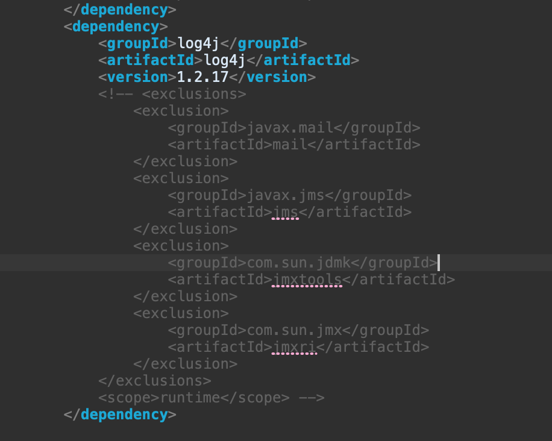

## @ContextConfiguration 어노테이션 오류 해결

* <a name="ContextConfigurationError">*@ContextConfiguration*</a> 는 xml 파일을 이용해 config파일 설정시 사용.

* 나는 java Configuration을 사용하여 Exception 이 발생함.

* `java.lang.IllegalStateException: Failed to load ApplicationContext`

  

* 해결방안!

  * Java Configuration 을 이용할 때는 `@ContextConfiguration` 어노테이션 사용시 경로를 다음과 같이 설정.

    * 변경전 (xml 사용시에 이렇게 씀.. 경로는 저거 말구 config.xml이 있는 경로로..)

    ```java
    @RunWith(SpringJUnit4ClassRunner.class)
    @ContextConfiguration("file:src/main/java/org/zerock/config/RootConfig.java")
    @Log4j
    public class SampleTests {...생략
    ```

  * 변경후

    ```java
    @RunWith(SpringJUnit4ClassRunner.class)
    @ContextConfiguration(classes = RootConfig.class)
    @Log4j
    public class SampleTests { ... 생략
    ```

  * java configuration 을 이용할 때는 `classes = class명.class` 이용!!!!!!!!


