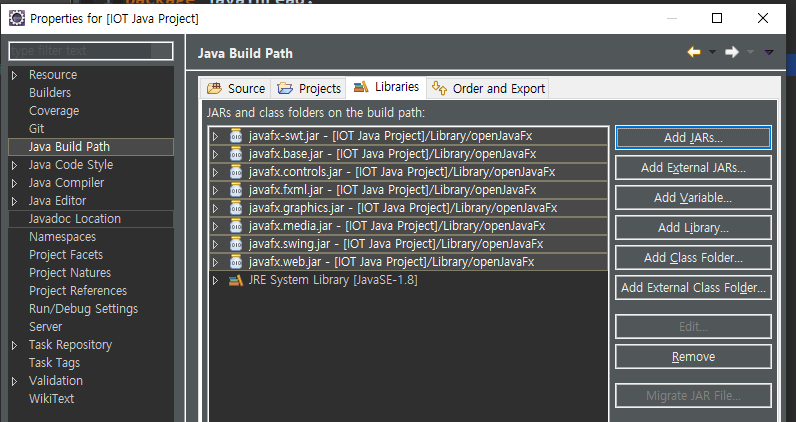
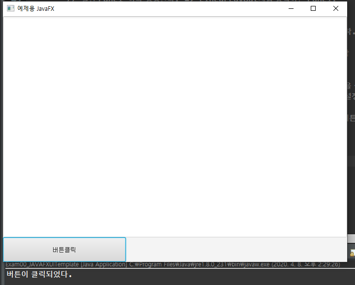
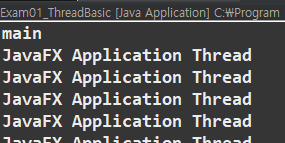

# Java Network, Java IO.

* 기본은 `Java Thread`

## Java FX

* `Java` 언어를 이용한 윈도우 프로그램 개발시 사용되는 `Open Library`.

* 해당 Library 를 프로젝트 properties 에서 추가.

  

### 창띄우기

* 일반적으로 특정 class 를 상속받아 사용 => `Application class ( javafx.application.Application )`

* 해당 클래스는 추상매서드 start() 매서드를 오버라이딩 해야함.

* start() 매서드는 Main() 매서드 에서 launch() 매서드를 통해 호출한다.

* 창을 만드는 코드는 start() 매서드에 작성.

  ```java
  package javaThread;
  
  import javafx.application.Application;
  import javafx.stage.Stage;
  
  // JavaFX 를 이용한 화면 UI 생성
  // JavaFX library 가 있어야 한다. => 추가하기. Project -> properties -> Java Build Path
  // FX 창 띄우기.
  // 1. Application 이라는 class 를 상속받아 우리 class 를 define 한다.
  // 2. Application이 갖고있는 start() abstract method를 overriding.
  //  
  
  public class Exam00_JAVAFXUITemplate extends Application {
  
  	@Override
  	public void start(Stage primaryStage) throws Exception {
  		// 화면을 구성하고 event 처리를 담당.
  		
  	}
  
  	public static void main(String[] args) {
  		// 화면에 창을 띄운다.
  		// 원래는 객체를 생성한 후 start() 호출. x
  		launch(); // start() method가 호출된다.
  
  	}
  
  }
  
  ```

* 화면 구성은 안드로이드의 Activity 화면 구성과 유사하다 생각하면 된다.

* 사용될 layout : BorderPane -> 화면의 Layout 이 동서남북 중앙으로 구성되어 있다.

* Button 과 TextArea 를 이용하여 화면에 나타낸다. Buton은 FlowPane을 이용하여 붙여서 사용한다.

* FlowPane은 Scene(장면) 에 부착하여 화면에 표현되고

* 만들어진 Scene 은 primarystage 에 부착하여 Window 화면으로 구성된다.

  ```java
  //Field 변수 
  private TextArea ta;
  private Button btn; 
  public void start(Stage primaryStage) throws Exception {
     		 // 기본 layout 을 생성.= BorderPane(동서남북중앙으로 구성)으로 생성.
  		BorderPane root = new BorderPane();
  		// BorderPane의 size를 설정.
  		root.setPrefSize(700, 500); // pixel 단위. (가로길이,세로길이)
  		
  		ta = new TextArea(); // 글상자 생성.
  		
  		root.setCenter(ta); // BorderPane 가운데에 TextArea 부착.
  
  		// 버튼생성
  		btn = new Button("버튼클릭");
  		btn.setPrefSize(250, 50);
  		// Button 을 클릭했을 때 이벤트 처리! Android 와 동일한 방식. 익명클래스 사용.
  		btn.setOnAction(new EventHandler() {
  			@Override
  			public void handle(Event arg0) {
  				System.out.println("버튼이 클릭되었다.");
  			}
  		});
  
  		// 일반 Panel 하나 생성한다. => LinearLayout처럼 동작하는 Panel.
  		FlowPane flowpane = new FlowPane();
  		flowpane.setPrefSize(700, 50);
  		flowpane.getChildren().add(btn); // FlowPane에 Button 을 부착.
  		
  		root.setBottom(flowpane); // 전체 화면의 아래부분에 FlowPane 부착
      	// 화면에이 보여지기 위해서는 Scene(장면) 이 필요하다.
  		Scene scene = new Scene(root); // BorderPane 을 포함하는 장면을 생성.
  		primaryStage.setScene(scene); // Window 의 화면을 Scene 으로 설정.
  		primaryStage.setTitle("예제용 JavaFX");
  		primaryStage.setOnCloseRequest(new EventHandler() {// x 버튼 눌렀을때 처리.
  			@Override
  			public void handle(Event arg0) {
  				System.exit(0);
  			}
  		});
  		primaryStage.show(); // 화면에 창 띄우기.
      
  }
  ```

  

* 위처럼 이벤트를 Inner Class 형태로 쓰는것이 일반적인 형태이나 코드가 너무 복잡하다.

* 이를 편하게 사용하기 위해 Lambda 식을 이용한다.

> 하지만 실제 코드는 위와같이 작성하지 않는다.
>
> 동기화가 일어나지 않아서 잘못된 결과를 나타낼 수 있다.
>
> 직접 UI component 를 제어하는 방법은 좋지 않다.
>
> Thread 를 이용해서 메시지 출력하는 방식으로 이용해야 한다.
>
> Thread 방식을 사용하기 위해 Platform 객체를 이용한다.

### Thread 이용

* Platform 객체를 이용한다.

```java
btn.setOnAction(e -> {
			// System.out.println("버튼이 클릭되었다.");
			// 동기화가 일어나지 않아서 잘못된 결과를 나타낼 수 있다.
			// 직접 UI component 를 제어하는 방법은 좋지 않다.
			// ta.appendText("버튼이 클릭되었다.\n");

			// Thread 를 이용해서 메시지 출력하는 방식으로 이용해야 한다.
			// Platform 객체를 이용.
			Platform.runLater( () -> {
				ta.appendText("버튼이 클릭됨\n");
			}

			);
		});
```


## Lambda

* 쉽게 이벤트 처리를 하기 위한 형식.

  > 람다를 사용하면 스트림 사용시 프로그램처리를 간소하게 할 수 있다.

  ```java
  // Lambda 사용 하지 않은 코드.
  btn.setOnAction(new EventHandler() {
  			@Override
  			public void handle(Event e) {
  				System.out.println("버튼이 클릭되었다.");
  			}
  		});
  primaryStage.setOnCloseRequest(new EventHandler() {// x 버튼 눌렀을때 처리.
  			@Override
  			public void handle(Event e) {
  				System.exit(0);
  			}
  		});
  
  // Lambda 사용한 코드
  btn.setOnAction((e) -> {
  			System.out.println("버튼이 클릭되었다.");
  			}
  		); // () 안에 변수가 1개이면 생략이 가능. e -> {...} 
  primaryStage.setOnCloseRequest(e -> {
  			System.exit(0);
  		});
  
  ```

  

## Java Thread

* Thread 는 독립적인 실행 흐름.
* 만드는 법
  1. Thread class 를 직접 상속해서 작성.
  2. Runnable Interface 를 구현한 객체를 이용해서 Thread 생성. => 이 방식으로 Android 에서 Thread 를 사용.


### Thread Basic

* 화면 출력을 편하게 하기위해 TextArea에 appendText 매서드를 하나의 클래스로 구현.

  ```java
  private void printMSG(String msg) {
  		Platform.runLater(() -> {
  			ta.appendText(msg + "\n");
  		});
  	}
  ```

  

* 현재 사용중인 `Thread` 확인

  ```java
  public static void main(String[] args) {
  		// 현재 사용되는 Thread의 이름을 출력.
  		System.out.println(Thread.currentThread().getName());
  		launch();
  	}
  ```

  

* start() 매서드 안에서도 확인

  ```java
  public void start(Stage primaryStage) throws Exception {
  		System.out.println(Thread.currentThread().getName());
      //.....생략
  }
  ```

  

  

* 동작순서 : main Thread 가 수행된 후 종료 되고 JavaFX Application Thread 가 실행됨.

* `printMSG()` 안에서도 확인

  ```java
  private void printMSG(String msg) {
  		Platform.runLater(() -> {
  			System.out.println(Thread.currentThread().getName());
  			ta.appendText(msg + "\n");
  		});
  	}
  ```

  

  > `printMSG()` 매서드가 수행되는 `Thread` 또한 `JavaFX Application Thread` 이다.

