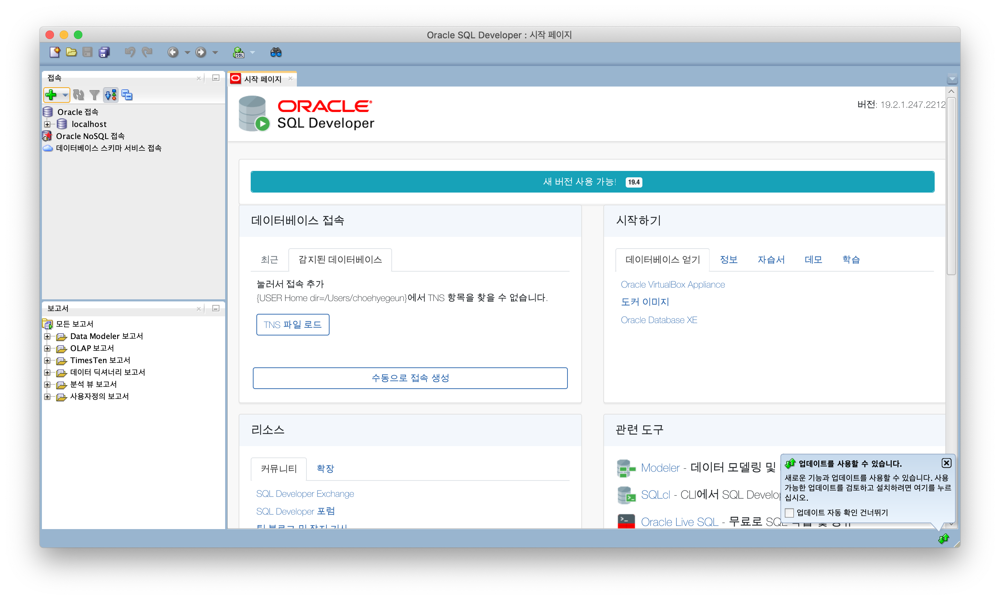
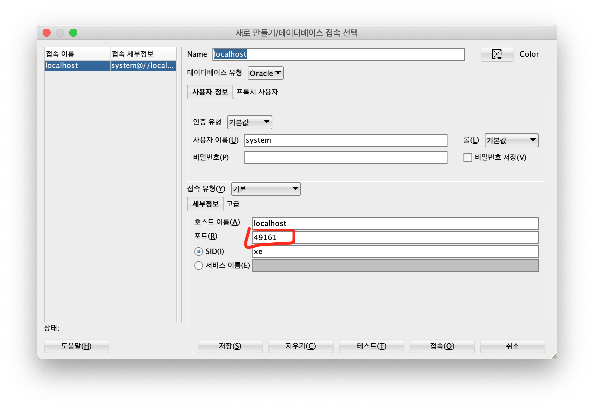
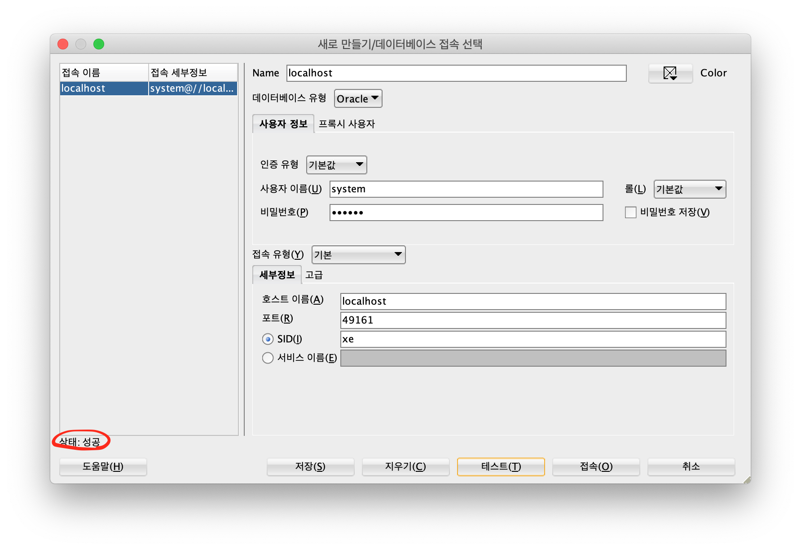
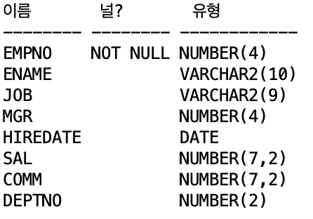
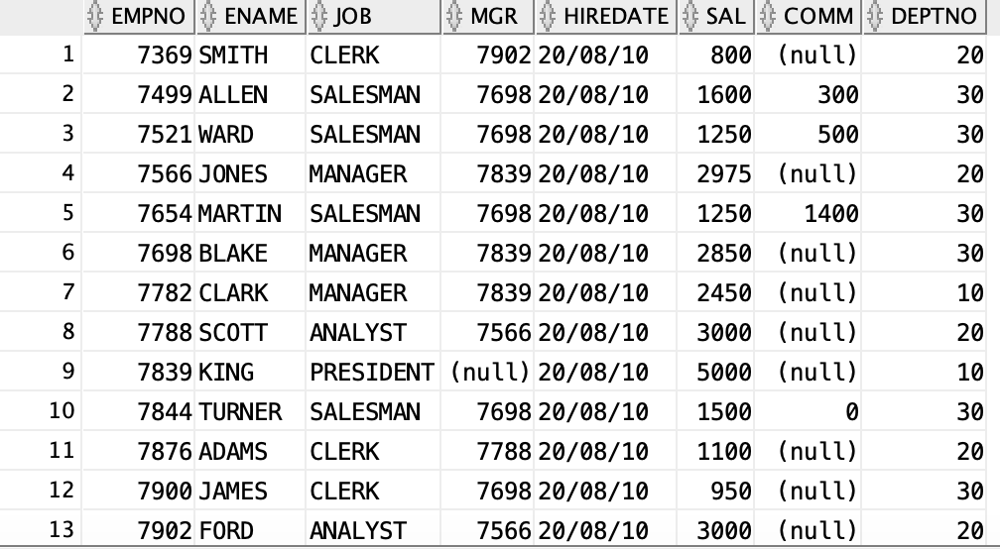
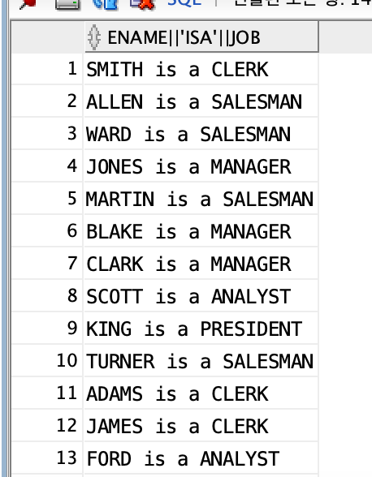
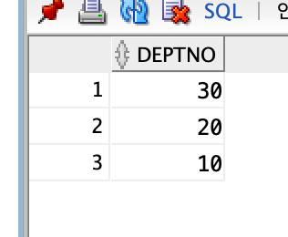
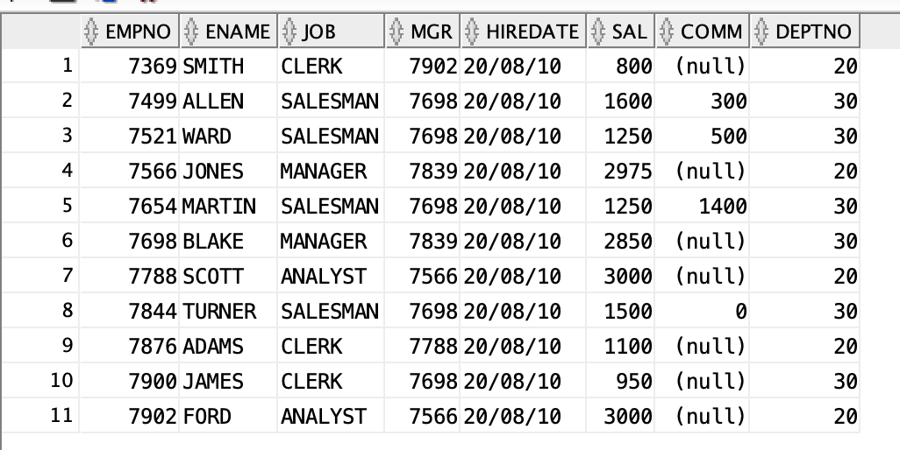

# Oracle Database in Mac OS

## DBMS ( Database Management System)

* Data 란 무엇인가? 
  * 모든 종류의 실체들을 컴퓨터로 쓸모 있게 만든것. -> 정보
* DBMS 종류
  * Oracle - VLDB에도 탁월
  * MySQL -Web DB로 탁월
  * MariaDB
  * Postgresql
* RDBMS vs NoSQL
  * RDBMS : table 로 구성된 DBMS ----> 정확한 데이터 처리가 진행되어 오류가 적다.
  * NoSQL : Json으로 DB를 설정.-> ex) MongoDB ------> 빅데이터 처리에 좋다. -----> NoSQL로 정제된 데이터를 RDBMS에 저장하는 형식.
* 관계형 DB : 중복을 제거해줌.


> Mac 에 오라클 설치시 자바 버전 설정
>
> - https://www.thatjeffsmith.com/archive/2014/12/java-8-on-a-mac-with-sql-developer-4-1/
>
> 


## Mac 에서 Oracle 설치

* Mac 에서 Oracle을 바로 사용할 수 없다.
* Docker 를 이용하여 Mac에 Oracle 설치가 가능하다.
* https://clearstar0817.tistory.com/10 블로그 글 참고.
* 도커 설치후 도커를 running 상태로 두고 커맨드 창에서 아래 명령어를 입력

```cmd
docker pull deepdiver/docker-oracle-xe-11g	#deepdiver의 oracle 11g 이미지를 받아옴
docker run -d -p 49160:22 -p 49161:1521 deepdiver/docker-oracle-xe-11g	#이미지를 컨테이너로 생성한 뒤 실행
docker ps	#컨테이너 목록을 출력
```


* 여기서 두번째 문장은 기존 xe의 포트번호가 1521 인 것을 도커의 49161 포트로 포워딩 시키는 명령어 이다.

* 설치후 SqlDeveloper 를 이용하거나 다음 명령어를 이용하여 커맨드(docker)에서 사용.

## CMD 이용하여 접속

* 먼저 저장된 NAMES 확인


* 다음 명령어 입력

```cmd
docker exec -it relaxed_swanson sqlplus
# relaxed_swanson 부분에 위에 찾은 NAMES를 입력
```


* 접속 완료!


## SqlDeveloper 이용

* sqlDeveloper를 사용하기 위해서는 Java 8버전 이 필요하다.
* 현재 필자는 Java 14 와 Java 8을 동시에 사용하여 경로설정을 모두 해줘야 한다.
* 이를 편하게 이용하기 위해 Jenv 를 이용하여 설정이 가능하다.
* 참고 블로그 - https://jojoldu.tistory.com/329



* 왼쪽 녹색 + 를 눌러 먼저 system 계정 로그인



* 원래 기존 xe의 포트번호는 1521 이지만 아까전 docker를 이용하여 49161 포트로 포워딩 시켰으므로 해당 포워딩 포트로 접속.
* 접속전 테스트로 확인. 
* 주의: 입력시 비밀번호 한글/영문 확인. 대문자 소문자 확인. 비밀번호 설정 안했을 경우 `oracle` 로 default 값으로 지정됨.




>Session , Cookie


## system 계정 이용하여 계정 만들기.

* sys / system 두 계정이 존재함.

### hr 계정 활성화 하기

```cmd
 SQL> grant connect,resource,unlimited tablespace to hr;
 # 비번 재설정, 계정 잠금해제
 SQL> alter user hr account unlock;
 SQL> alter hr identified hr; # 비밀번호 변경
 
```

### oracle port 번호 변경하기

```cmd
SQL> select dbms_xdb.gethttpport() from dual; # 포트확인

SQL> exec dbms_xdb.sethttpport(8283); # 포트번호 변경
```

### Scott 계정 만들기

* oracle xe 11 버전부터 scott/tiger 계정을 지원하지 않는다고 한다.
* 고로 직접 만들어 테이블을 넣어준다.

```cmd
# system 계정에서 scott 생성
SQL> create user scott identified by tiger;
# 유저 잠금해제
SQL> alter user scott identified by tiger account unlock;
SQL> GRANT CONNECT,RESOURCE,UNLIMITED TABLESPACE TO SCOTT IDENTIFIED BY TIGER;
```

* 계정 생성후 sqlDeveloper 를 이용하여 테이플 생성.

```sql
DROP TABLE EMP;
DROP TABLE DEPT;
DROP TABLE BONUS;
DROP TABLE SALGRADE;
DROP TABLE DUMMY;
 
CREATE TABLE EMP
       (EMPNO NUMBER(4) NOT NULL,
        ENAME VARCHAR2(10),
        JOB VARCHAR2(9),
        MGR NUMBER(4),
        HIREDATE DATE,
        SAL NUMBER(7, 2),
        COMM NUMBER(7, 2),
        DEPTNO NUMBER(2));
 
INSERT INTO EMP VALUES
        (7369, 'SMITH',  'CLERK',     7902,
        sysdate,  800, NULL, 20);
         
INSERT INTO EMP VALUES
        (7499, 'ALLEN',  'SALESMAN',  7698,
        sysdate, 1600,  300, 30);
         
INSERT INTO EMP VALUES
        (7521, 'WARD',   'SALESMAN',  7698,
        sysdate, 1250,  500, 30);
         
INSERT INTO EMP VALUES
        (7566, 'JONES',  'MANAGER',   7839,
        sysdate,  2975, NULL, 20);
         
INSERT INTO EMP VALUES
        (7654, 'MARTIN', 'SALESMAN',  7698,
        sysdate, 1250, 1400, 30);
         
INSERT INTO EMP VALUES
        (7698, 'BLAKE',  'MANAGER',   7839,
        sysdate,  2850, NULL, 30);
         
INSERT INTO EMP VALUES
        (7782, 'CLARK',  'MANAGER',   7839,
        sysdate,  2450, NULL, 10);
INSERT INTO EMP VALUES
        (7788, 'SCOTT',  'ANALYST',   7566,
        sysdate, 3000, NULL, 20);
         
INSERT INTO EMP VALUES
        (7839, 'KING',   'PRESIDENT', NULL,
        sysdate, 5000, NULL, 10);
         
INSERT INTO EMP VALUES
        (7844, 'TURNER', 'SALESMAN',  7698,
        sysdate,  1500,    0, 30);
         
INSERT INTO EMP VALUES
        (7876, 'ADAMS',  'CLERK',     7788,
        sysdate, 1100, NULL, 20);
         
INSERT INTO EMP VALUES
        (7900, 'JAMES',  'CLERK',     7698,
        sysdate,   950, NULL, 30);
         
INSERT INTO EMP VALUES
        (7902, 'FORD',   'ANALYST',   7566,
        sysdate,  3000, NULL, 20);
         
INSERT INTO EMP VALUES
        (7934, 'MILLER', 'CLERK',     7782,
        sysdate, 1300, NULL, 10);
 
CREATE TABLE DEPT
       (DEPTNO NUMBER(2),
        DNAME VARCHAR2(14),
        LOC VARCHAR2(13) );
 
INSERT INTO DEPT VALUES (10, 'ACCOUNTING', 'NEW YORK');
INSERT INTO DEPT VALUES (20, 'RESEARCH',   'DALLAS');
INSERT INTO DEPT VALUES (30, 'SALES',      'CHICAGO');
INSERT INTO DEPT VALUES (40, 'OPERATIONS', 'BOSTON');
 
CREATE TABLE BONUS
        (ENAME VARCHAR2(10),
         JOB   VARCHAR2(9),
         SAL   NUMBER,
         COMM  NUMBER);
 
CREATE TABLE SALGRADE
        (GRADE NUMBER,
         LOSAL NUMBER,
         HISAL NUMBER);
 
INSERT INTO SALGRADE VALUES (1,  700, 1200);
INSERT INTO SALGRADE VALUES (2, 1201, 1400);
INSERT INTO SALGRADE VALUES (3, 1401, 2000);
INSERT INTO SALGRADE VALUES (4, 2001, 3000);
INSERT INTO SALGRADE VALUES (5, 3001, 9999);
 
CREATE TABLE DUMMY
        (DUMMY NUMBER);
 
INSERT INTO DUMMY VALUES (0);
 
COMMIT;
```


## 테이블

* 테이블은 실제 데이터가 담기는 그릇
* 데이터가 담기는 기준이자, 실제 데이터가 어떻게 담길지에 대한 정보를 담고 있다.


## SQL

* Sqtructured Query Language
* DDL : 데이더 정의어
* DML : 데이터 조작어
* DCL : 데이터 제어어
* TCL : 트랜잭션 제어어
* DQL ( select )

## scott 계정 갖고놀기

### 테이블 가져오기

```sql
select * from tab;
```


### EMP 테이블 구조.

```sql
desc emp;
```



### EMP 테이블 데이터

```sql
select * from emp;
```




> DB 테이블에서 데이터 타입
>
> 1. NUMBER : 숫자
> 2. VARCHAR2 : 문자열 (Text)
> 3. date : 날짜


### 문법

1. `select 문`

   ```sql
   select column(조회할 컬럼-속성)
   from table(조회할 테이블)
   group by (컬럼)
   having (조건)
   where condition(검색 조건)
   order by (정렬)
   ```


### null check!

* `nvl()` 함수를 이용하여 null 값 체크 가능.

  ```sql
  select ename, sal, sal*12 + nvl(comm,0) as years from emp;
  ```

  

### alias (별칭)

```sql
select ename, sal, sal*12 + nvl(comm,0) as 연봉 from emp;
-- as 생략가능
select ename, sal, sal*12 + nvl(comm,0) 연봉 from emp;
select ename, sal, sal*12 + nvl(comm,0) as AnnSal from emp;
select ename, sal, sal*12 + nvl(comm,0) as "Annual Salary" from emp;
```


### concatenation

* 문자열 합치기 `||` 이용

  ```sql
  select ename || ' is a ' ||job from emp;
  ```

  

### distinct

* 중복값이 있을 시 1번만 출력

  ```sql
  select distinct deptno from emp;
  ```

  


### 비교 연산자

* `=, >, <, >=, <=, <>(!=,^=)`

  ```sql
  select * from emp where deptno <> 10;
  ```

  

### 데이터 추가

* insert 로 데이터 추가

  ```sql
  insert into emp (empno, ename) values(1234,'ford');
  ```

  