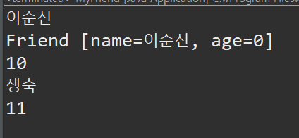
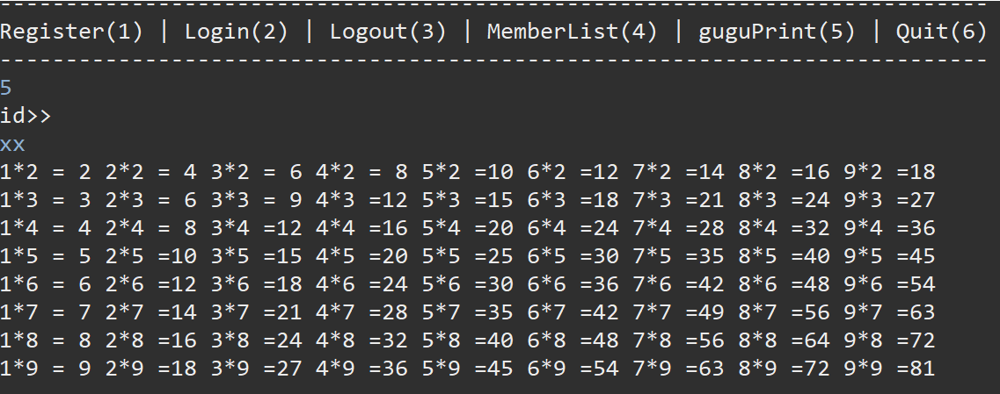
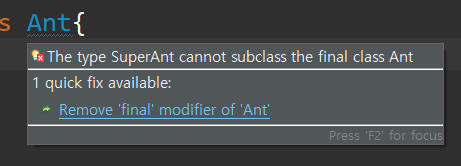
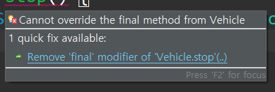

# day07

## 접근제한자

* public: 프로젝트 전체에서 접근 가능
 * protected: 같은 패키지와 다른 패키지의 상속 받은 클래스에서 접근 가능
 * default: 같은 패키지에서 접근 가능
 * private: 클래스 내부에서만 접근 가능

## encapsulation(캡슐화)

* 정보은닉의 특징.

### Getter, Setter

* 클래스 내부 변수에 직접 접근하지 못하고 Getter, Setter  메소드를 통해 접근 가능하게 구현.

  ```java
  package class08_getter_setter;
  
  // DTO : Data Transfer Object (VO: Value Object), Domain
  // encapsulation (정보 은닉)
  class Friend {
  
  	private String name;
  	private int age;
  
  	public Friend(String name) {
  		this.name = name;
  	}
  
  	public String getName() {
  		return name;
  	}
  
  	public void setName(String name) {
  		this.name = name;
  	}
  
  	public int getAge() {
  		return age;
  	}
  
  	public void setAge(int age) {
  		if (age >= 10) {
  			this.age = age;
  		} else {
  			System.out.println("10살 이상만 친구가능.");
  		}
  	}
  
  	@Override
  	public String toString() {
  		return "Friend [name=" + name + ", age=" + age + "]";
  	}
  
  }
  
  public class MyFriend {
  
  	public static void main(String[] args) {
  
  //		Friend fr = new Friend();
  //		fr.name = "이순신";
  //		System.out.println(fr.name);
  
  		Friend fr = new Friend("이순신");
  		System.out.println(fr.getName());
  		System.out.println(fr);
  
  		fr.setAge(10);
  		System.out.println(fr.getAge());
  
  		celebrateBirthday(fr);
  		System.out.println(fr.getAge());
  
  	}
  
  	private static void celebrateBirthday(Friend fr) {
  		System.out.println("생축");
  		fr.setAge(fr.getAge() + 1);
  	}
  
  }
  
  ```

  

> 롬복(Lombok)
>
> 어노테이션을 이용하여 DTO Vo 에서 Getter, Setter 매서드를 자동으로 만들어 주는 라이브러리.


## 로그인 & 로그아웃 구현


* Member(DTO)

  ```java
  package class08_getter_setter;
  
  public class Member {
  	
  	private String name;
  	private int age;
  	private String id;
  	private String pwd;
  	
  	private boolean login = false;
  
  	
  	
  	
  	public Member(String name, int age, String id, String pwd) {
  		super();
  		this.name = name;
  		this.age = age;
  		this.id = id;
  		this.pwd = pwd;
  	}
  
  	public String getName() {
  		return name;
  	}
  
  	public void setName(String name) {
  		this.name = name;
  	}
  
  	public int getAge() {
  		return age;
  	}
  
  	public void setAge(int age) {
  		this.age = age;
  	}
  
  	public String getId() {
  		return id;
  	}
  
  	public void setId(String id) {
  		this.id = id;
  	}
  
  	public String getPwd() {
  		return pwd;
  	}
  
  	public void setPwd(String pwd) {
  		this.pwd = pwd;
  	}
  
  	public boolean isLogin() {
  		return login;
  	}
  
  	public void setLogin() {
  //		if(this.login==true) {
  //			this.login = false;
  //		}else {
  //			this.login = true;
  //		}
  		this.login = !login;
  	}
  
  	@Override
  	public String toString() {
  		return "Member [name=" + name + ", age=" + age + ", id=" + id + ", pwd=" + pwd + ", login=" + login + "]";
  	}
  	
  	
  	
  }
  
  ```

* MemberService (DAO & Controller)

  ```java
  package class08_getter_setter;
  
  public class MemberService {
  
  	private Member[] mb = new Member[100];
  	private int count = 0;
  
  	public MemberService() {
  		mb[count++] = new Member("aa", 11, "aa", "aa");
  		mb[count++] = new Member("bb", 11, "bb", "bb");
  		mb[count++] = new Member("cc", 11, "cc", "cc");
  		mb[count++] = new Member("dd", 11, "dd", "dd");
  	}
  
  	public Member regist(String name, int age, String id, String pwd) {
  		mb[count++] = new Member(name, age, id, pwd);
  		return mb[count - 1];
  	}
  
  	public int login(String id, String pwd) {
  
  		for (Member m : mb) {
  			if (m != null && m.getId().equals(id) && m.getPwd().equals(pwd)) {
  				if (!m.isLogin()) {
  					m.setLogin();
  					return 1;
  				}
  			}
  		}
  		return 0;
  	}
  
  	public String logout(String id) {
  		for (Member m : mb) {
  			if (m != null && m.getId().equals(id)) {
  				m.setLogin();
  				return "logout";
  			}
  		}
  		return "로그아웃 실패";
  	}
  
  	public void listMember() {
  		int num = 0;
  		for (Member m : mb) {
  			if (m != null) {
  				System.out.println(m);
  				num++;
  			}
  		}
  		System.out.println("총 " + num + "명");
  	}
  
  	public void guguPrint(String id) {
  		
  		boolean check = false;
  		
  		for (Member m : mb) {
  			if (m != null && m.getId().equals(id) ) {
  				if (m.isLogin()) {
  					gugudan();
  					return;
  				} else {
  					System.out.println("로그인 해야합니다.");
  					return;
  				}
  			}
  		}
  		
  		System.out.println("없는 회원입니다.");
  		
  
  	}
  
  	private void gugudan() {
  		for (int i = 2; i < 10; i++) {
  			for (int j = 1; j < 10; j++) {
  				System.out.printf("%d*%d =%2d ", j, i, i * j);
  			}
  			System.out.println();
  		}
  
  	}
  
  }
  
  ```

* MemberEx (View)

  ````java
  package class08_getter_setter;
  
  import java.util.Scanner;
  
  public class MemberEx {
  	public static void main(String[] args) {
  
  		MemberService ms = new MemberService();
  
  		Scanner sc = new Scanner(System.in);
  
  		String name;
  		int age;
  		String id;
  		String pwd;
  		Member mem;
  		Loop: while (true) {
  
  			System.out.println("---------------------------------------------------------------------------");
  			System.out.println("Register(1) | Login(2) | Logout(3) | MemberList(4) | guguPrint(5) | Quit(6)");
  			System.out.println("---------------------------------------------------------------------------");
  			
  			int service = Integer.parseInt(sc.nextLine());
  			
  			switch (service) {
  			case 1:
  
  				System.out.println("name>>");
  				name = sc.nextLine();
  				System.out.println("age>>");
  				age = Integer.parseInt(sc.nextLine());
  				System.out.println("id>>");
  				id = sc.nextLine();
  				System.out.println("pwd>>");
  				pwd = sc.nextLine();
  				mem = ms.regist(name, age, id, pwd);
  				if (mem != null) { // null check
  					System.out.println("가입 성공");
  					System.out.println(mem);
  				} else {
  					System.out.println("가입 실패");
  				}
  				break;
  			case 2:
  				System.out.println("id>>");
  				id = sc.nextLine();
  				System.out.println("pwd>>");
  				pwd = sc.nextLine();
  				if (ms.login(id, pwd) == 1) {
  					System.out.println("login success");
  				} else {
  					System.out.println("id or pwd is wrong");
  				}
  				
  				break;
  			case 3:
  				System.out.println("id>>");
  				id = sc.nextLine();
  				System.out.println(ms.logout(id));
  				break;
  			case 4:
  				ms.listMember();
  				break;
  			case 5:
  				System.out.println("id>>");
  				id = sc.nextLine();
  				ms.guguPrint(id);
  				break;
  			case 6:
  				System.out.println("종료 하시겠습니까? y / n");
  				String sel = sc.nextLine();
  				if (sel.toLowerCase().trim().equals("y")) {
  					System.out.println("bye have fun!");
  //					System.exit(0);
  					break Loop;
  				}
  				break;
  			default:
  				System.out.println("잘못된 입력");
  				break;
  			}
  		}
  		sc.close();
  
  	}
  }
  
  ````

* 출력

  * 회원생성

    

  * 로그인

    

  * 로그아웃

    

  * 구구단출력 성공

    

  * 실패

    

  * 종료

    

## 상속 (extends)

* 상속은 `extends` 키워드를 통해 사용할수 있다.

* class B extends A - 부모 class A를 상속받은 B

* B 클래스는 A의 매서드를 직접 사용할 수도 있고 재정의 (Overriding) 하여 사용할 수 있다.

  ```java
  
  class A{
  	int a =1;
  	
  	void a() {
  		System.out.println("parent a()");
  	}
  	
  	@Override
  	public String toString() {
  		return "a = " + a + " 안녕";
  	}
  }
  
  // 상속(extends): super class(부모클래스)와 변수와 메소드를 그대로 물려받고
  // 추가로 자기 변수와 자기 메소드를 가질 수도 있으며, 물려받은 변수와 메소드를 고쳐서 쓸 수도 있다.
  class B extends A{
  	
  	int b = 7;
  	void b() {
  		System.out.println("child b()");
  	}
  	
  	@Override
  	void a() {
  		System.out.println("child a()");
  		super.a();
  	}
  	
  }
  
  
  public class In01 {
  	public static void main(String[] args) {
  		A a1 = new A();
  		a1.a();
  		System.out.println(a1.a);
  		System.out.println(a1);
  		System.out.println("-------------");
  		
  		B b1 = new B();
  		b1.a();
  		System.out.println(b1.a);
  		System.out.println(b1);
  		b1.b();
  		System.out.println(b1.b);
  		System.out.println(b1);
  		System.out.println("-------------");
  		
  		
  		
  		
  	}
  }
  
  ```

* 상속에서 중요한 다형성!

  * 상속을 한다면 아래처럼 선언이 가능하다.

  ```java
  A a2 = new B();
  ```

  * 이럴 경우 a2 객체는 사실상 A객체 이지만 사실은 B객체이다.(뭔 개소리냐.)
  * 이 경우 a2의 a() 메소드를 실행하면 Overriding 된 B객체의 a() 매서드가 실행이 된다.
  * 또한 해당 객체는 강제 형변환을 통해 자식 객체로 주입이 가능하다.
  * 또한 이 상태에서는 a2는 B객체에서만 선언된 메소드들을 사용할 수 없다.
  * B객체 메소드를 이용하기 위해서는 강제 형변환이 필요하다.

  ````java
  // 자식 객체로 주입
  B b2 = (B)a2; 
  b2.b();
  // b() 을 사용하기 위해서 B로 형변환 해야함
  ((B)a2).b(); 
  ````


### Class 의 관계

* 상속관계

  * B는 A이다.
  * EX) 앰블런스는 자동차이다.

* 포함관계 (소유관계) 

  * A 가 B를 갖고 있다.
  * EX) 자동차는 타이어를 갖고 있다.

  ```java
  package class09_inheritance;
  
  import java.util.Date;
  
  class Tire {
  	String brand;
  	Date produced;
  }
  
  class Car {
  	String color;
  	int door;
  	Tire[] tires; // 포함관계 차는 타이어를 갖고 있다.
  
  	void drive() {
  		System.out.println("차가 달려간다.");
  	}
  
  	void stop() {
  		System.out.println("차가 멈춘다.");
  	}
  
  	void print() {
  		System.out.println(this.getClass() + "=> color: " + color + " / door: " + door);
  	}
  
  	void fly() {
  		System.out.println("차가 난다.");
  	}
  }
  
  // 상속관계 : 앰뷸런스는 자동차이다.
  class Ambulance extends Car {
  	String cross;
  
  	@Override
  	void drive() {
  		super.drive();
  		System.out.println("앰뷸런스다. 길을 비켜라");
  	}
  
  	void siren() {
  		System.out.println("앰뷸앰뷸");
  	}
  }
  
  class FireEngine extends Car{
  	String hose;
  	
  	@Override
  	void drive() {
  		super.drive();
  		System.out.println("불자동차임. 길을비켜라");
  	}
  	void extinguish() {
  		System.out.println("물 뿌려");
  	}
  }
  
  public class In02 {
  	public static void main(String[] args) {
  		
  		Car car1 = new Car();
  		car1.color = "blue";
  		car1.door = 4;
  		car1.print();
  		System.out.println("----------------------");
  		Ambulance am1 = new Ambulance();
  		FireEngine fe1 = new FireEngine();
  		car1.drive();
  		am1.drive();
  		fe1.drive();
  		System.out.println("----------------------");
  		
  		Car car2 = new Ambulance();
  		Car car3 = new FireEngine();
  		
  		Car[] garage = {car1,car2,car3};
  		
  		for(Car c: garage) {
  			c.drive();
  			System.out.println(">>>>>>>>>>>>>>>>>>");
  		}
  		
  		
  	}
  }
  
  ```


* 상속의 장점 - 여러타입의 자식 객체를 한번에 처리 할 수 있다.
  * 부모 클래스의 배열로 묶을 수 있다.
  * 반복문 사용에 편리함.


### instance of 연산자

* 객체를 확인해 주는 연산자.

* 자신이 new 로 생성된 객체로 확인함.

  ```java
  		Car car1 = new Car();
  		Car car2 = new Ambulance();
  		Car car3 = new FireEngine();
  		
  		Car[] garage = {car1,car2,car3};
  		 
  		for(Car c: garage) {
  			c.drive();
  			if(c instanceof Ambulance) {
  				((Ambulance) c).siren();
  			}else if(c instanceof FireEngine) {
  				((FireEngine) c).extinguish();
  			}
  			System.out.println(">>>>>>>>>>>>>>>>>>");
  		}
  ```

  

## 상수 이용

```java
package class09_inheritance;

class Airplane{
	void fly() {
		System.out.println("normal flying");
	}
	void takeOff(){
		System.out.println("take off!!!");
	}
	void land() {
		System.out.println("landing");
	}
}

class Supersonic extends Airplane{
	static final int NORMAL = 0;
	static final int SUPERSONIC = 1;
	
	int flymode = NORMAL;
	
	@Override
	void fly() {
		if(flymode == SUPERSONIC) {
			System.out.println("sonic boom! supersonic power!!!");
		}else {
			super.fly();
		}
	}
	
	@Override
	public String toString() {
		String[] mode = {"NORMAL", "SUPERSONIC"};
		return "현재 비행모드: " + mode[flymode];
	}
	
}
public class In05 {
	public static void main(String[] args) {
		Supersonic ss = new Supersonic();
		ss.takeOff();
		ss.fly();
		System.out.println(ss);
		ss.flymode = Supersonic.SUPERSONIC;
		ss.fly();
		System.out.println(ss);
		ss.flymode = 0;//Supersonic.NORMAL
		ss.fly();
		ss.land();
	}
}
```


### 상수 클래스 (final class)

* 상수 클래스는 상속 불가능.

  

### 상수 매서드 (final method)

* 상수 매서드는 Override 불가능.

  

### 매서드 상속시 주의점

* `@Override` 를 통해 재정의한 매서드는 반환타입, 메소드 이름, 매개변수의 타입과 수가 다를수 없다.

* 또한 해당 메서드의 접근제한자를 축소할 수 없다. (변경 불가능)

* Exception의 경우 없는 Exception 발생 불가능.

  

### 상속 장점

*  부모 객체로 만든 배열에 자식배열을 넣어서 한번에 처리가 가능하다.


##  Enumeration

* 상수를 관리하는  class

*  열거형 클래스

  * 특정 개수의 변수값을 나열하여 사용함으로써 오타를 방지함.(데이터 무결성)

  ```java
  enum Season{
  	SPRING,
  	SUMMER,
  	AUTUMN,
  	WINTER
  }
  ```

  ```java
  package class11_Enumeration;
  // 모든 필드가 상소, 상수는 단어 사이를 _로 표기
  public enum LoginResult {
  	LOGIN_SUCCESS,
  	LOGIN_FAILED
  }
  ```

* 요일관리

  ``` java
  package class11_Enumeration;
  
  import java.util.Calendar;
  
  public class WeekEx {
  	public static void main(String[] args) {
  		
  		Week today = null;
  		
  		Calendar cal = Calendar.getInstance();
  		System.out.println(cal);
  		
  		int weekday = cal.get(Calendar.DAY_OF_WEEK);
  		switch(weekday) {
  		case 1:
  			today = Week.SUNDAY;
  			break;
  		case 2:
  			today = Week.MONDAY;
  			break;
  		case 3:
  			today = Week.TUESDAY;
  			break;
  		case 4:
  			today = Week.WEDNESDAY;
  			break;
  		case 5:
  			today = Week.THURSDAY;
  			break;
  		case 6:
  			today = Week.FRIDAY;
  			break;
  		case 7:
  			today = Week.SATURDAY;
  		}
  		System.out.println("오늘 요일: " + today);
  		if(today == Week.WEDNESDAY) {
  			System.out.println("공부하는 날");
  		}else {
  			System.out.println("더 많이 공부하는 날");
  		}
  	}
  }
  
  
  public enum Week {
  	MONDAY,
  	TUESDAY,
  	WEDNESDAY,
  	THURSDAY,
  	FRIDAY,
  	SATURDAY,
  	SUNDAY
  }
  ```


## 추상클래스

* 추상 클래스: 상속 받은 자식클래스들에게 추상 메소드들을 재정하도록 강요하는 클래스이다.

  ```java
  package abstract01;
  
  // 추상 클래스는 생성 불가능.
  public abstract class Phone {
  	String owner;
  	
  	public Phone(String owner) {
  		this.owner = owner;
  	}
  	
  	void turnOn() {
  		System.out.println("Power On");
  	}
  	
  	void turnOff() {
  		System.out.println("Power Off");
  	}
  	
  	abstract void connectInternet();
  }
  
  class TwoGPhone extends Phone{
  	
  	public TwoGPhone(String owner) {
  		super(owner);
  	}
  	
  	@Override
  	void connectInternet() {
  		
  		System.out.println("can not connect");
  	}
  }
  class ThreeGPhone extends Phone{
  	
  	public ThreeGPhone(String owner) {
  		super(owner);
  	}
  	
  	@Override
  	void connectInternet() {
  		
  		System.out.println("3G ~~~~");
  	}
  }
  class FiveGPhone extends Phone{
  	
  	public FiveGPhone(String owner) {
  		super(owner);
  	}
  	
  	@Override
  	void connectInternet() {
  		
  		System.out.println("5G ~~~~");
  	}
  }
  
  
  ```

* 실행

  ```java
  package abstract01;
  
  public class PhoneEx {
  	public static void main(String[] args) {
  		
  		// abstract class inner class형태로 선언
  		Phone phone = new Phone("jane") {
  			@Override
  			void connectInternet() {
  				System.out.println("?????");
  			}
  		};
  		
  		TwoGPhone twoGPhone = new TwoGPhone("ace");
  		System.out.println(twoGPhone.owner + "의 전화기");
  		twoGPhone.turnOn();
  		twoGPhone.turnOff();
  		System.out.println("------------------------------");
  		Phone[] ph = {twoGPhone, new ThreeGPhone("tom"),new FiveGPhone("bc")};
  		for(Phone p : ph) {
  			System.out.println(p.owner + "의 전화기");
  			p.turnOn();
  			p.connectInternet();
  			p.turnOff();
  			System.out.println("------------------------------");
  		}
  		
  	}
  }
  ```

  