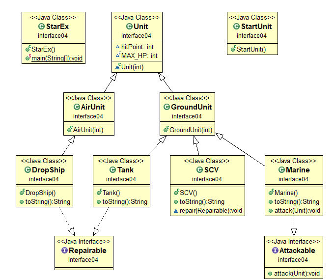
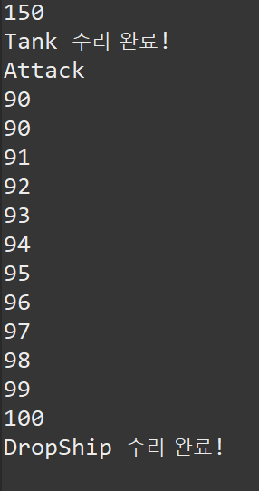
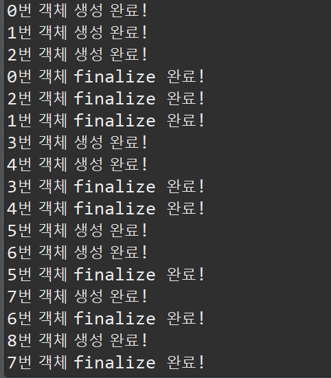
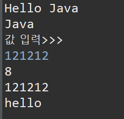

# JavaDay08

## interface

* interface 에서 필드변수는 기본적으로 `public static final`로 생성된다. (생략되어 있다.)

  ```java
  public interface Animal {
  	// 앞에 public static final 가 생략되어 있음.
  	String OWNER = "cat";
  	public static final String KIND = "cat";
  }
  ```

* interface 는 implements 를 이용하여 구현.

  * interface

  ```java
  package interface01;
  
  public interface Animal {
  
  	String OWNER = "TOM";
  	public static final String KIND = "cat";
  	
  	// 메소드는 추상메소드만 가질 수 있음.
  	abstract void sound();
  	void eat();	
  }
  ```

  * cat

  ```java
  public class Cat implements Animal {
  
  	String name;
  
  	public Cat(String name) {
  		this.name = name;
  	}
  
  	@Override
  	public void eat() {
  		System.out.println(OWNER + " 의 고양이 " + name + " 이 냠");
  	}
  
  	@Override
  	public void sound() {
  		
  		System.out.println(OWNER + " 의 고양이 " + name + " 이 야옹야옹");
  	}
  }
  ```

  * dog

  ```java
  public class Dog implements Animal {
  
  	String name;
  
  	public Dog(String name) {
  		this.name = name;
  	}
  
  	@Override
  	public void eat() {
  		System.out.println(OWNER + " 의 강아지 " + name + " 이 쩝");
  	}
  
  	@Override
  	public void sound() {
  		System.out.println(OWNER + " 의 강아지 " + name + " 이 멍멍");
  		
  	}
  }
  ```

  * main

  ```java
  public class AnimalEx {
  	public static void main(String[] args) {
  		// interface 는 객체생성 불가능
  //		Animal ani = new Animal();
  		Animal cat = new Cat("구름");
  		Animal dog = new Dog("파랑");
  		
  		Animal[] ani = {cat,dog};
  		for(Animal k: ani) {
  			k.eat();
  			k.sound();
  			System.out.println("-----------------------");
  		}
  		
  		Animal tiger = new Animal() {
  			
  			@Override
  			public void sound() {
  					System.out.println(OWNER+" 의 호랑이 등장");
  			}
  			
  			@Override
  			public void eat() {
  				System.out.println(OWNER+" 의 호랑이 밥먹");
  			}
  		};
  		
  		tiger.sound();
  		tiger.eat();
  	}
  }
  ```

### interface 를 받는 추상클래스 상속

* 추상메서드 또한 interface를 받을수 있다.

* 해당 추상클래스를 상속받는 클래스는 추상클래스의 추상메서드와 interface의 추상메서드 모두 오버라이딩 해주어야 한다.

* interface

  ```java
  public interface Robot {
  	
  	void recharge();
  }
  ```

* abstract class

  ```java
  // 구현한 인터페이스의 추상메소드를 오버라이딩하지 않을 거면 자신이 추상클래스 여야 한다.
  abstract class CodingRobot implements Robot{
  	String name;
  	abstract void program();
  }
  ```

* class

  ```java
  class JavaRobot extends CodingRobot{
  
  	@Override
  	public void recharge() {
  		// TODO Auto-generated method stub
  		
  	}
  
  	@Override
  	void program() {
  		// TODO Auto-generated method stub
  		
  	}
  	
  }
  ```

* interface는 다중 상속(implements) 가 가능하다.

* 또한 interface가 interface를 구현할 수 있다.

### Java 7 이후 추가된 기능

#### default method

* 기존 interface 에서는 method 구현이 안되었지만 java 7 이후부터 `default` 예약어를 이용하여 interface method를 구현할 수 있다.

  ```java
  public interface RemoteControl {
  //	static final int MAX_VOLUME = 10;
  	// 아래 둘다 static final 
  	int MAX_VOLUME = 10;
  	int MIN_VOLUME = 0;
  	
  	// 추상 메소드
  	void turnOn();
  	void turnOff();
  	void setVolume(int volume);
  	void play();
  	
  	// default method
  	// interface 기능확장
  	default void setMute(boolean mute) {
  		if(mute) {
  			System.out.println("무음처리");
  		}else {
  			System.out.println("무음해제");
  		}
  	}
  }
  
  ```

#### static method

* static으로도 선언가능

* 사용시 `인터페이스명.메소드명` 로 사용

  ```java
  //static method: 인터페이스명.메소드명
  	static void changeBattery() {
  		System.out.println("리모콘 건전지 교환");
  	}
  ```

### interface 의 역할

* 객체간 연결을 해주는 역할을 한다.

* 스타크래프트 예시

  

  > UML 표시해주는 Library
  >
  > * ObjectAid Exploere 사용.
  > *  Eclipse 안에서 사용이 가능하다.

* SCV가 repair() 매서드로 받을수 있는 매개변수는 interface Repairable 를 구현한 객체만 받을 수 있다.

* SCV

  ```java
  class SCV extends GroundUnit {
  	
  	public SCV() {
  		super(80);
  		hitPoint = MAX_HP;
  	}
  
  	@Override
  	public String toString() {
  		return "SCV";
  	}
  	
  	void repair(Repairable r) {
  		Unit unit = (Unit) r;
  		System.out.println(unit.hitPoint);
  		
  		
  		while (unit.hitPoint < unit.MAX_HP) {
  			unit.hitPoint++;
  			System.out.println(unit.hitPoint);
  		}
  		System.out.println(r + " 수리 완료!");
  	}
  }
  ```

* Tank

  ```java
  class Tank extends GroundUnit implements Repairable {
  
  	public Tank() {
  		super(150);
  		hitPoint = MAX_HP;
  	}
  
  	@Override
  	public String toString() {
  		return "Tank";
  	}
  }
  ```

* Marin

  ```java
  class Marine extends GroundUnit implements Attackable{
  
  	public Marine() {
  		super(30);
  		hitPoint = MAX_HP;
  	}
  
  	@Override
  	public String toString() {
  		return "Marine";
  	}
  
  	@Override
  	public void attack(Unit u) {
  		int damage = 10;
  		System.out.println("Attack");
  		u.hitPoint -= damage;
  		System.out.println(u.hitPoint);
  	}
  }
  ```

* main

  ```java
  package interface04;
  
  public class StarEx {
  	public static void main(String[] args) {
  		Marine m = new Marine();
  		Tank t = new Tank();
  		DropShip d = new DropShip();
  		SCV scv = new SCV();
  		scv.repair(t);
  		
  		m.attack(d);
  		
  		
  		scv.repair(d);
  	}
  }
  ```

  


> 참고
>
> 많이쓰는 DB
>
> * mysql
> * mariadb
> * postgresql

## Java Api

### Object class

* 모든 객체는 Object를 상속받는다.

#### equals() 매서드

* 객체의 주소를 비교하는 매서드.

* Overriding을 하여 나만의 비교를 정의할 수 있다.

  ```java
  package api01_object;
  
  class Student{
  	
  	int studentId;
  	String studentName;
  	
  	public Student(int studentId, String studentName){
  		this.studentId = studentId;
  		this.studentName = studentName;
  	}
  	
  	public String toString(){
  		return studentId + "," + studentName;
  	}
  
  	@Override // object 클래스의 equals (객체 주소 비교) 를 오버라이딩
  	public boolean equals(Object obj) { // 매개변수 Object 타입 - 모든 객체를 다 받을 수 있다.
  		if(obj instanceof Student){// 만약 매개변수로 받은 오브젝트가 Student의 객체라면
  			Student std = (Student)obj; // Student type으로 강제 형변환
  			if( studentId == std.studentId) // this 객체의 id가 매개변수로 받은 객체의 id와 주소가 같다면 
  				return true;
  			else return false;
  		}
  		// 매개변수로 받은 객체가 Student 객체가 아닐때
  		return false;
  	}
  //
  //	@Override
  //	public int hashCode() {
  //		return studentId;
  //	}
  	
  }
  
  public class EqualsTest {
  
  	public static void main(String[] args) {
  
  		Student studentLee = new Student(100, "이상원");
  		Student studentLee2 = studentLee; //
  		Student studentSang = new Student(100, "이상원");
  		// 동일한 주소의 두 인스턴스 비교
  		if(studentLee == studentLee2)
  			System.out.println("studentLee와 studentLee2의 주소는 같습니다.");
  		else
  			System.out.println("studentLee와 studentLee2의 주소는 다릅니다.");
  		if(studentLee.equals(studentLee2))
  			System.out.println("studentLee와 studentLee2는 동일합니다.");
  		else
  			System.out.println("studentLee와 studentLee2는 동일하지 않습니다.");
  		
  //		//주소는 다르지만 equals 의 결과가 true 인 경우
  		if(studentLee == studentSang)
  			System.out.println("studentLee와 studentSang의 주소는 같습니다.");
  		else
  			System.out.println("studentLee와 studentSang의 주소는 다릅니다.");
  		if(studentLee.equals(studentSang))
  			System.out.println("studentLee와 studentSang은 동일합니다.");
  		else
  			System.out.println("studentLee와 studentSang은 동일하지 않습니다.");
  //
  //		System.out.println("studentLee의 hashCode :" +studentLee.hashCode());
  //		System.out.println("studentSang의 hashCode :" +studentSang.hashCode());
  //		
  //		System.out.println("studentLee의 실제 주소값 :"+ System.identityHashCode(studentLee));
  //		System.out.println("studentSang의 실제 주소값 :"+ System.identityHashCode(studentSang));
  	
  	}
  }
  
  ```

* Object class 에서 hashCode() 매서드를 오버라이딩 하게 되면 `==`연산에 대한 값이 달라진다.

  ```java
  @Override
  	public int hashCode() {
  		return studentId;
  	}
  ```

  ```java
  Student studentLee = new Student(100, "이상원");
  		Student studentLee2 = studentLee; //
  		Student studentSang = new Student(100, "이상원");
  		// 동일한 주소의 두 인스턴스 비교
  		if(studentLee == studentLee2)
  			System.out.println("studentLee와 studentLee2의 주소는 같습니다.");
  		else
  			System.out.println("studentLee와 studentLee2의 주소는 다릅니다.");
  ```

  

*  이러한 상황은 HashMap Collection 사용시에  Key값을 비교할 때 사용될 수 있다.

* objecet 를 HashMap의 Key로 넣을때 Hashcode가 다르면 다른 객체로 인식을 하게된다.

#### clone() 매서드

* 

#### finalized() 매서드 의미

* 해당 객체가 gc로 정리되기전 사용됨.

  ```java
  package api01_object;
  
  public class Counter {
  	
  	private int no;
  	
  	public Counter(int no) {
  		this.no = no;
  		System.out.println(no + "번 객체 생성 완료!");
  	}
  	
  	@Override
  	protected void finalize() throws Throwable {
  		super.finalize();
  		System.out.println(no + "번 객체 finalize 완료!");
  	}
  	
  	@Override
  	public String toString() {
  		// TODO Auto-generated method stub
  		return super.toString();
  	}
  }
  ```

* main

  ```java
  package api01_object;
  
  public class CounterEx {
  	public static void main(String[] args) {
  		
  		Counter counter = null;
  		
  		for(int i =0; i< 50; i++) {
  			counter = new Counter(i);
  			counter = null;
  			System.gc();
  		}		
  	}	
  }
  ```

  

### Class class

* class 의 정보를 받아오는 class
* 객체의 `getClass()` 객체의 반환형이 Class 클래스이다.
* `Class.forName("java.lang.String")` 매서드는 해당 객체의 Class명을 지정해 줄 수 있다. 재정의 하면 해당 값이 출력된다.
* `Class.newInstance()` 사용시 앞에 원하는 객체를 캐스팅 해주면 해당 객체로 객체를 새로 생성해 준다. `new` 생성자와 같은 의미이다.


### String class

* 문자열 객체.

* 여러 매서드 존재함.

* 스트링 객체를 사용할 때 Encoding에 따라 값이 달라진다.

  ```java
  package api02_String;
  
  import java.io.UnsupportedEncodingException;
  import java.util.Arrays;
  
  public class String02 {
  	public static void main(String[] args) {
  		//String -> byte[]  -> String (data 전달 과정)
  		String str = "안녕하세요";
  		byte[] b1 = str.getBytes();
  		System.out.println(Arrays.toString(b1));
  		System.out.println("b1.length: "+ b1.length); // 한글은 3byte로 처리되고 있다.
  		String str2 = new String(b1);
  		System.out.println("byte -> String: " + str2);
  		
  		byte[] b2,b3;
  		try {
  			b2 = str.getBytes("euckr");
  			System.out.println("b2.length: "+ b2.length); // 한글은 3byte로 처리되고 있다.
  			String str3 = new String(b2);
  			System.out.println("byte -> String: " + str3);
  			
  		} catch (UnsupportedEncodingException e) {
  			e.printStackTrace();
  		}
  		
  	}
  	
  }
  
  ```

  

  

* 스트링 객체는 문자열, 바이트 배열, 문자 배열(char[]) 로 객체를 생성할 수 있다.
* 실제 물리적인 통신을 (네트워크) 할때는 문자열을 byte 형태로 전송함.

  ```java
  package api02_String;
  
  import java.io.IOException;
  
  public class String01 {
  	public static void main(String[] args) throws IOException {
  		String tom = "tom";
  		String tom2 = new String("tom");
  		
  		byte[] bytes = {72,101,108,108,111,32,74,97,118,97};
  		String str = new String(bytes);
  		System.out.println(str);
  		
  		String str2 = new String(bytes,6,4);
  		System.out.println(str2);
  		
  		byte[] bytes2 = new byte[100];
  		System.out.println("값 입력>>>");
  		int readByteNo = System.in.read(bytes2); // 읽은 byte길이를 int로 읽어줌.
  		System.out.println(readByteNo);
  		
  //		String str3 = new String(bytes2,0,readByteNo); // 엔터 입력값 \r\n두개 포함됨
  		String str3 = new String(bytes2,0,readByteNo-2); // -2 : \r \n 포함 안됨
  		System.out.println(str3);
  		
  		char[] greet = {'h','e','l','l','o'};
  		String hi = new String(greet);
  		System.out.println(hi);
  	}
  }
  
  ```

  

