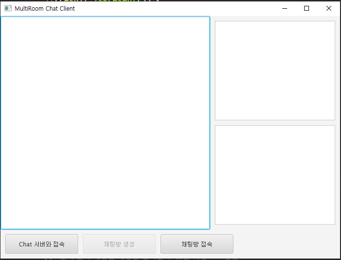
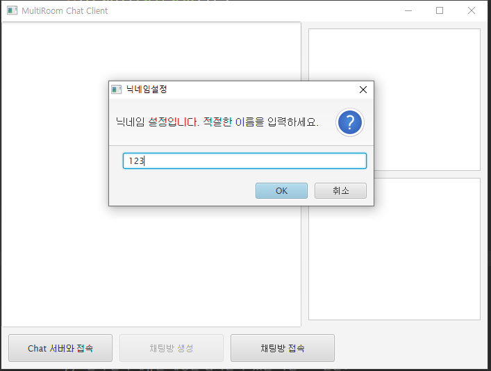
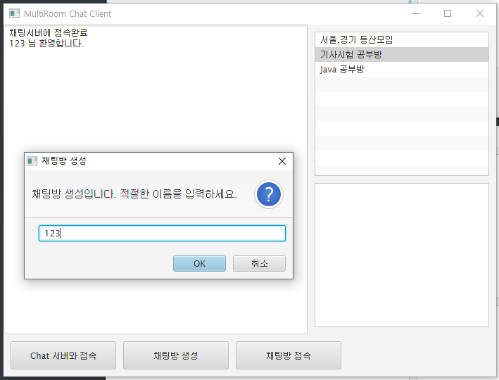
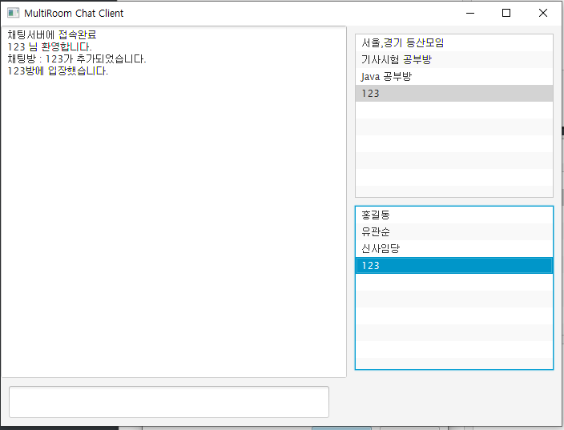

# 2020-04-20

# Java Network Day 03


> 프로그램 작성 (3일간)
>
> * 여러개의 방에서 채팅을 진행하는 프로그램을 작성
> * 프로그램 스킬을 늘리기에 상당히 좋다.
> * 어떤 기능을 갖고 프로그램을 작성할건지는 클라이언트 프로그램을 작성하면서 알아보자.

## Multi Room Chat

* 기본적인 클라이언트 UI 구성.

  ```java
  package javanetwork.multiecho.lec;
  
  import java.util.Optional;
  
  import javafx.application.Application;
  import javafx.application.Platform;
  import javafx.geometry.Insets;
  import javafx.scene.Scene;
  import javafx.scene.control.Button;
  import javafx.scene.control.Dialog;
  import javafx.scene.control.ListView;
  import javafx.scene.control.TextArea;
  import javafx.scene.control.TextField;
  import javafx.scene.control.TextInputDialog;
  import javafx.scene.layout.BorderPane;
  import javafx.scene.layout.FlowPane;
  import javafx.scene.layout.GridPane;
  import javafx.stage.Stage;
  
  // JavaFX를 이용해서 Client창 띄우기.
  public class Exam05_MultiRoomChatClient extends Application {
  
  	// Field 정의
  	private String userID; // Client Chat ID
  	private TextArea textarea; // 채팅창 역할을 하는 TextAreaO
  	private Button connBtn; // 채팅서버와 연결을 하기 위한 버튼
  	private Button disconnBtn; // 채팅서버와 연결을 종료하기 위한 버튼
  	private Button createRoomBtn; // 새로운 채팅방을 만드는 버튼
  	private Button connRoomBtn; // 채팅방에 들어가는 버튼
  	private ListView<String> roomListView; // 채팅방 목록을 보여주는 ListView
  	// 채팅방에서 현재 채팅에 참여하고 있는 사람들의 목록을 보여주는 ListView
  	private ListView<String> participantsListView;
  
  	// TextArea에 내용을 출력하기 위해서 method를 정의
  	private void printMSG(String msg) {
  		Platform.runLater(() -> {
  			textarea.appendText(msg + "\n");
  		});
  
  	}
  
  	@Override
  	public void start(Stage primaryStage) throws Exception {
  
  		BorderPane root = new BorderPane(); // 화면을 동서남북중앙 5개의 영역으로 분할
  		root.setPrefSize(700, 500);
  
  		// 화면중앙에 TextArea 를 붙인다.
  		textarea = new TextArea();
  		textarea.setEditable(false); // editing이 안되게끔 처리.
  		root.setCenter(textarea); // 화면 중앙에 textarea를 배치.
  		// 방목록을 표현하는 ListView를 생성
  		roomListView = new ListView<String>();
  		// 방안에서 채팅하는 사람들의 목록을 표현하는 ListView를 생성
  		participantsListView = new ListView<String>();
  
  		// 화면을 격자로 나누어서 component를 표현하는 Layout
  		GridPane gridpane = new GridPane();
  		// gridpane의 padding부터 설정. (판 자체의 여백)
  		gridpane.setPadding(new Insets(10, 10, 10, 10));
  
  		// gridpane안에 여러 component가 붙는데 이 component간의 여백을 설정.
  		gridpane.setVgap(10); // Vgap : 세로여백 ,Hgap : 가로여백
  
  		gridpane.add(roomListView, 0, 0); // 0열 0행
  		gridpane.add(participantsListView, 0, 1); // 0열 1행
  
  		root.setRight(gridpane); // 화면 오른쪽에 GridPane 부착.
  
  		connBtn = new Button("Chat 서버와 접속");
  		connBtn.setPrefSize(150, 40);
  		connBtn.setOnAction(e -> {
  			// 서버 접속 버튼을 누르면 사용자 ID부터 받는다.\
  			Dialog<String> dialog = new TextInputDialog("자신의 닉네임을 입력하세요.");
  			dialog.setTitle("닉네임설정");
  			dialog.setHeaderText("닉네임 설정입니다. 적절한 이름을 입력하세요.");
  			// 화면에 dialog를 띄우고 기다리기. 사용자가 확인이나 취소 누를 때 까지.
  
  			Optional<String> result = dialog.showAndWait();
  			String entered = "";
  			if(result.isPresent()) {
  				// 닉네임을 입력하고 확인버튼을 누른 Case.
  				entered = result.get();
  			}
  			// 원래는 서버에 접속해서 방 목록을 받아와야 한다.
  			roomListView.getItems().add("서울,경기 등산모임");
  			roomListView.getItems().add("기사시험 공부방");
  			roomListView.getItems().add("Java 공부방");
  			
  			printMSG("채팅서버에 접속완료");
  			printMSG(entered+" 님 환영합니다.");
  			userID = entered;
  			createRoomBtn.setDisable(false);
  			
  		});
  		
  		createRoomBtn = new Button("채팅방 생성");
  		createRoomBtn.setPrefSize(150, 40);
  		createRoomBtn.setDisable(true);
  		createRoomBtn.setOnAction(e->{
  			Dialog<String> dialog = new TextInputDialog("생성할 방 이름을 입력하세요.");
  			dialog.setTitle("채팅방 생성");
  			dialog.setHeaderText("채팅방 생성입니다. 적절한 이름을 입력하세요.");
  			
  			Optional<String> result = dialog.showAndWait();
  			String entered = "";
  			if(result.isPresent()) {
  				// 방이름을 입력하고 확인버튼을 누른경우.
  				entered = result.get();
  			}
  			// 방 이름이 서버에 전달이 되어야 한다.
  			roomListView.getItems().add(entered);
  			printMSG("채팅방 : "+entered+"가 추가되었습니다.");
  		});
  		
  		connRoomBtn = new Button("채팅방 접속");
  		connRoomBtn.setPrefSize(150, 40);
  		connRoomBtn.setOnAction(e->{
  			// 1. 어떤방을 선택했는지 알아야한다.
  			String roomName = 
  					roomListView.getSelectionModel().getSelectedItem();
  			printMSG(roomName + "방에 입장했습니다.");
  			
  			// 서버에 접속해서 현재 방에 참여하고 있는 참여자 목록을 받아야 한다.
  			// 목록을 받아오면 참여자 리스트뷰에 출력
  			participantsListView.getItems().add("홍길동");
  			participantsListView.getItems().add("유관순");
  			participantsListView.getItems().add("신사임당");
  			participantsListView.getItems().add(userID);
  			
  			// 밑 부분의 메뉴를 채팅을 입력할 수 있는 화면으로 전환.
  			FlowPane inputFlow = new FlowPane();
  			inputFlow.setPadding(new Insets(10,10,10,10));
  			inputFlow.setPrefSize(700, 40);
  			inputFlow.setHgap(10);
  			
  			TextField inputTF = new TextField();
  			inputTF.setPrefSize(400, 40);
  			inputFlow.getChildren().add(inputTF);
  			inputTF.setOnAction(v->{
  				printMSG(userID + ": "+inputTF.getText());
  				inputTF.clear();
  			});
  			root.setBottom(inputFlow);
  		});
  		
  		
  		FlowPane menuFlowPane = new FlowPane();
  		menuFlowPane.setPadding(new Insets(10,10,10,10));
  		menuFlowPane.setPrefSize(700, 40);
  		menuFlowPane.setHgap(10);
  		menuFlowPane.getChildren().add(connBtn);
  		menuFlowPane.getChildren().add(createRoomBtn);
  		menuFlowPane.getChildren().add(connRoomBtn);
  		
  		root.setBottom(menuFlowPane);
  		// 창을 띄우기 위한 코드
  		Scene scene = new Scene(root);
  		primaryStage.setScene(scene);
  		primaryStage.setTitle("MultiRoom Chat Client");
  		primaryStage.setOnCloseRequest(e -> {
  
  		});
  		primaryStage.show();
  	}
  
  	public static void main(String[] args) {
  		launch(args);
  	}
  }
  
  ```

* 위 코드는 네트워크 연결 없이 Client UI 구성만 이룸.

* 결과

  

  

  

  