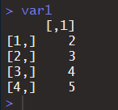
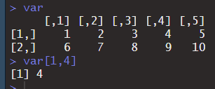
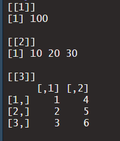

# 2020-03-10

---

* 어제정리
  * 데이터 분석
    * R에서 EDA(탐색적 데이터 분석)
      * 주어진 데이터 안에서 알고자하는 데이터를 추출.
      * 데이터 내에 숨겨져 있는 특정한 사실을 유추해내는 작업.
    * 통계적 가설 검정
      * 통계기법을 이용. 
      * 통계하는 이유 : 전수조사 불가능하기 떄문에
      * 표본을 통해 전체를 예측.
    * 머신러닝 -> 딥러닝 으로 진행되는게 일반적인 순서.

---

## Matrix

1. 2차원 구조
2. 행과 열로 구성됨.
3. 같은 데이터 타입만 저장이 가능하다.

### 1. Matrix 만들기

* `matrix()` 함수 이용.

```R
var1 <- matrix(c(1:5))
```

* 기본적으로 안에 있는 데이터를 1열로 채움.

  

* `nrow` 속성을 통해 행 갯수 지정 가능.

  ```R
  var1 <- matrix(c(1:10),nrow=2)
  ```

  

* 행 갯수가 맞지 않으면 빈 칸은 Recycle Rule 이 적용이 된다.

  ```R
  var1 <- matrix(c(1:11),nrow=2)
  ```

  

* `byrow` 속성을 이용해 행 방향으로 채움.

  ```R
  var1 <- matrix(c(1:10), nrow = 2, byrow = TRUE)
  ```

  

* 다른 함수를 이용한 Matrix 생성

  * vector 2개를 이용하여 Matrix 생성

  * `rbind()` 함수 이용 : 행방향으로 붙임.

    ```R
    var1 = 1:4
    var2 = 5:8
    
    mat1 = rbind(var1,var2)
    mat1
    ```

    

  * `cbind()` 함수이용 : 열 방향으로 붙임.

    ```R
    var1 = 1:4
    var2 = 5:8
    
    mat1 = cbind(var1,var2)
    mat1
    ```

    

### 2. Matrix 사용법

* 일반적인 2차원 indexing 방법과 동일하다.

  ```R
  var <- matrix(c(1:10),nrow=2, byrow = TRUE) 
  var
  var[1,4]
  ```

  

* 행을 명시하지 않으면 모든 행의 열을 출력 결과는 vector 형태로 return. 열 명시 안하는것도 동일.

  ```R
  var[,4]
  var[1,]
  ```

  

* Matrix 갯수 출력 : `length()` 함수 이용.

  ```R
  length(var)
  ```

  

* `nrow`() : 행의 갯수 출력.

* `ncol()` : 열의 갯수 출력.

  ```R
  nrow(var)
  ncol(var)
  ```

  

---

## Array

### 1. 3차원 이상의 Array를 만드는 법.

* `array()` 함수 이용.

  * 첫 속성 : 들어갈 data
  * `dim` 속성 : vector형태로 행, 열,면 지정.

  ```R
  var1 <- array(c(1:24),dim = c(3,2,4))#3행 2열 4개의 면.
  var1
  ```

  ```CQL
  , , 1
  
       [,1] [,2]
  [1,]    1    4
  [2,]    2    5
  [3,]    3    6
  
  , , 2
  
       [,1] [,2]
  [1,]    7   10
  [2,]    8   11
  [3,]    9   12
  
  , , 3
  
       [,1] [,2]
  [1,]   13   16
  [2,]   14   17
  [3,]   15   18
  
  , , 4
  
       [,1] [,2]
  [1,]   19   22
  [2,]   20   23
  [3,]   21   24
  ```

---

## Factor

* 범주형 데이터 타입.
* 방의크기 (대, 중, 소) 를 입력해야함 : `level`


* 명목형
  * `level`에 순서개념이 없는것.
  * 예시) 좌,우 
* 순서형
  * `level`에 순서개념이 있는것.
  * 예시) 대, 중, 소

### factor만들기

* vector 를 이용하여 factor만들기.

* factor 생성 함수는 `factor()` 함수 파라미터로 vector를 받아줌.

  ```R
  var1 <- c("A","B","AB","O","A","AB") # vector 생성.
  var1_factor <- factor(var1) # 순서개념 없는 명목형 factor
  var1_factor
  ```

  

* `levels()`함수를 통해 `level`만 추출 가능.

  ```R
  levels(var1_factor)
  ```

  

* 일반적인 방법의 factor만들기.

* `levels` 속성을 통해 level 지정 가능.

  ```R
  var1 <- c("A","B","AB","O","A","AB")
  var1_factor <- factor(var1, levels = c("A","B","O")) #AB는 범주에 포함되지 않아 NA로 표현
  var1_factor
  ```

  

* `ordered` 속성을 통해 순서형 factor로 생성 가능.

  * 순서는 `levels` 속성의 순서대로 적용.

  ```R
  var1_factor <- factor(var1,levels = c("A","B","O"), ordered = TRUE)
  var1_factor
  ```

  

---

## List

* 1차원 선형구조.
* 여러형태의 자료형이 같이 저장될 수 있다.
* 각 index 위치에 값이 저장될 때 map 형태로 저장된다. (key 와 value의 쌍의 형태).
* 중첩 자료구조.
* 값을 넣을때 map 형태로 넣어야 함.

### List 만들기

> JSON 처리시 유용함.
>
> JSON 처리시 파라미터를 list로 받아옴.

* `list()` 함수를 이용해 생성.

  ```R
  var1_scalar = 100
  
  var2_vector = c(10,20,30)
  
  var3_matrix = matrix(c(1:6), nrow = 3)
  
  myList = list(var1_scalar,var2_vector,var3_matrix)
  ```

  

* key 값을 명시 하지 않으면 순서로 잡힘. `[[1]]`

* key 값을 이용하여 출력가능

  ```R
myList[[2]]
  myList[[2]][1]
  ```
```
  
  
  
  
  
  * ket 값을 지정
  
    ```R
    myList <- list(name=c("홍길동","김길동"),
                   age=c("20","30"),
                   gender=c("남자","여자")) # key = value 형식.
    myList
    
    myList$age
```


* key, 순번으로 access 가능

  ```R
    myList$age
    myList[[2]]
    myList[["age"]]
  ```

  

---


## Data Frame

* R에서 가장 많이 쓰이고 가장 중요한 자료구조.
* 행과 열로 구성된 2차원 형태의 Table.
* 데이터베이스의 Table과 같은 구조라고 생각하면 됨.
* 컬럼단위로 서로 다른 타입의 데이터 저장이 가능하다.

### Data Frame 만들기

* `data.frame()` 함수 이용.

* 컬럼명 = 값 형태로 저장.

* 사이즈가 맞지 않으면 생성 불가능.

  ```R
  df = data.frame(NO=c(1,2,3),
                  Name=c("홍길동","이순신","강감찬"),
                  Age=c(20,30,40))
  ```

  

* `View()` 함수를 통해 Data Frame을 볼 수 있다.

* 원하는 column만 보고싶을 때 `$` 이용하여 컬럼명 지정.

  ```R
  df$Name
  df$Age
  ```

  

  * 문자열은 기본적으로 factor 형태로 출력
  * `stringsAsFactors` 속성을 통해 factor가 아닌 문자열로 표현가능.

  ```R
  df = data.frame(NO=c(1,2,3),
                  Name=c("홍길동","이순신","강감찬"),
                  Age=c(20,30,40),
                  stringsAsFactors=FALSE)
  df$Name
  ```

  

### Data Frame 추출해서 새롭게 만들기

* 많이 사용되는 방식.

* data frame 먼저 만들기.

  ```R
  df <- data.frame(x=c(1:5),
                   y=seq(2,10,2),
                   z=c("a","b","c","d","e"),
                   stringsAsFactors = FALSE)
  ```

* `subset(df,조건)` 함수를 이용해 추출가능하다.

  ```R
  subset1 <- subset(df,x>=3) # x가 3이상인 행만 추출하기.
  subset2 <- subset(df,x>=3 & y<=8)# x값이 3이상이고 y값이 8이하인 행만 추출하기.
  ```

  

---

## 연습문제 풀기

1. 4,5,7,8,10,3 의 숫자를 이용해서 숫자벡터 x를 생성하기.

```R
x <- c(4,5,7,8,10,3)
print(x)
```

2. 다음 연산을 수행한 결과

   ```R
   x1 <- c(3,5,7,9)
   x2 <- c(3,5,3)
   x1 + x2 # recycle rule 적용되어 계산.
   ## 결과 6, 8, 10, 12
   ```

3. Data Frame과 subset을 이용해서 다음의 결과를 만들어 보기.

   ```R
   Age <- c(22,25,18,20)
   Name <- c("홍","최","박","홍")
   Gender <- c("M",'F','M','F')
   
   # 1) 위의 3개의 vector를 이용하여 df 를 만들기.
   df <- data.frame(Age=Age,
                    Name=Name,
                    Gender=Gender,
                    stringsAsFactors = FALSE) # 문자열 factor로 처리하지 않게 사용.
   # 2) subset을 이용해 다음의 결과를 출력
   ## Age Nage Gender
   ## 22   홍   M
   ## 18   박   M
   subset1 <- subset(df,Gender=="M")
   subset1
   ```

   

4. 다음의 R코드를 실행시킨 결과는? (Boolean indexing)

   ```R
   x <- c(2,4,6,8)
   y <- c(TRUE,FALSE,TRUE,FALSE)
   
   # logical 백터를 다른백터의 index로 지정할수 있다.
   x[y]        # Boolean Indexing
   # 전제조건 : size 같아야함.
   # TRUE 위치만 남기고 나머지는 버림.
   
   x[1:3] 	    # Slicing
   x[c(1,2,4)] # Fancy Indexing
   
   sum(x[y]) # sum(), min(), max(), min() 기본함수.
   ```

   

   

   

  5. 아래의 계산결과는?

  ```R
  x <- c(1:4)
  (x+2)[(!is.na(x))& x>2] -> k # !is.na(x) >>> T,T,T,T # x>2 >>> F,F,T,T
  k						   # (!is.na(x))& x>2 >>> F,F,T,T Mask set 기법.
  ```

6. 결측치 갯수 구하기 (missing value) => NA

   ```R
   x <- c(10,20,30,NA,40,50,60,NA,NA,100)
   # vector 안에있는 NA 갯수 출력
   sum(is.na(x)) # FALSE는 0, TRUE는 1이기 때문에 NA의 갯수를 확인할 수 있다.
   ```

---

---

---

## 문자열 처리.

* 빅데이터 처리에서 문자열처리는 꽤나 빈번하게 발생되는 작업이다.

* 기본적인 R의 base system을 이용해서 문자열을 처리하는건 그다지 좋은 방식은 아니다.

* 문자열처리에 대한 대표적인 package가 있다. 

  * `stringr` 

    1. 패키지 사용을 위해 설치진행.

       ```R
       install.packages("stringr")
       ```

    2. package loading

       ```R
       library(stringr) # require(stringr)
       ```

    3. 문자열 준비.

       ```R
       myStr= "Honkd1051Leess4504YOU25홍길동1004"
       ```

    4. 해당 문자열을 이용해서 stringr의 기능을 알아보자.

### stringr 패키지

* `stringr` 의 패키지 함수들은 `str_`로 시작

1. 문자열의 길이 알아보기.

   * `str_length(Charater)` 함수사용.

   * 한글과 영문 모두 1개로 취급한다. 인코딩상관없이.

   ```R
   myStr= "Honkgd1051Leess4504YOU25홍길동1004"
   str_length(myStr) # 문자열의 길이를 알아보는 str함수
   ```

2. 찾고자 하는 문자열의 시작위치와 끝위치 알아보는 함수.

   * `str_locate(Charater,"찾을 문자열")` 함수사용.

   ```R
   str_locate(myStr,"Lee")
   str_locate(myStr,"0") # 첫번째 0만 검색.
   str_locate_all(myStr,"0") # 모든 0을 검색 리턴타입 list 안쪽에 matrix 형태로 출력.
   ```

   

3. 부분문자열

   ```R
   str_sub(myStr,2,5) # 2:시작위치 5:끝위치.
   ```

   

4. 소문자 대문자 변경

   ```R
   str_to_upper(myStr)
   str_to_lower(myStr)
   ```

   

5. 문자열 교체

   ```R
   str_replace(myStr,"홍길동","신사임당")
   ```

   

6. 문자열 결합

   ```R
   str_c(myStr,"1234")
   ```

   

7. 문자열 분리

   ```R
   myStr= "Honkgd105,1Leess4504,YOU25,홍길동1004"
   str_split(myStr,",") # 백터로 쪼개서 출력됨.
   ```

   

### 정규표현식

* regular expression
* 특정한 패턴을 표현하기 편함.
* R 뿐만 아니라 모든 언어에 통용됨.


* stringr에 정규식을 이용해서 내가 원하는 형태의 문자열을 추출하는 함수

  * `str_extract_all()` 함수 : 내가 원하는 정규식에 맞는 문자열 모두 추출하는 함수.

    ```R
    myStr= "Honkgd105,1Leess4504,YOU25,홍길동1004"
    
    str_extract_all(myStr,"[a-z]{3}") #대괄호 : [] 안에 나오는 문자중 한개 -> 알파벳 소문자 출력.
    					#중괄호 : {} 안에 나오는 숫자만큼 반복되는수 -> 소문자 연달아3개 나오는것.
    
    str_extract_all(myStr,"[a-z]{3,}") #{3,} : 3번 이상으로 나오는것 출력 {최소값,최대값}
    
    str_extract_all(myStr,"[a-z]{3,4}") # onkg eess
    
    str_extract_all(myStr,"[가-힣]{3}") # 한글 3글자 출력
    
    str_extract_all(myStr,"[0-9]{4}") # 숫자 4자리 출력
    ```

    

  * `^` 를 추가해 주므로 아닌것을 출력 할 수 있다.

    ```R
    str_extract_all(myStr,"[^a-z]{3}") # 영문자 소문자가 포함안된 3개 연속인 문자열 출력.
    ```

    


## 데이터의 입출력

* 데이터 분석을 하기 위해서는 가장 먼저 데이터를 준비해야 한다.


### 키보드로 입력받기

* 입력은 console에서 입력.

1. `scan()` : 숫자만 가능함.

   * `what` 속성을 통해 문자열 받을수 있다.

   ```R
   myNum = scan() # 숫자만 가능함.
   myNum
   myData = scan(what = character())
   myData
   ```

   

2. `edit()` : data frame에 데이터를 집적 입력할때 사용.

   ```R
   df = data.frame()
   my_df = edit(df)
   ```

   

   

### 파일처리(read)

* `read.table()` 함수를 이용.

* 인코딩 `UTF-8`로 맞춰서 txt 파일 하나 만들기.

  * 마지막 빈 공간이 있게 저장해야 오류가 발생하지 않는다.

  

  ```R
  df <- read.table("data/student_midterm.txt", #("R기준 경로")
                   sep = ",")  # , 기준으로 분리
  df
  ```

  * file에 header가 포횜되어 있는 경우

    * `header` 속성 사용.

    ```R
    df <- read.table("data/student_midterm.txt",
                     sep = ",",
                     header = TRUE)
    ```

    

    * 위와 같은 오류가 생겼을때... R과 txt의 인코딩이 서로 맞지 않기 때문에 발생.

    * `fileEncoding` 속성 사용.

      ```R
      df <- read.table("data/student_midterm.txt",
                       sep = ",",
                       header = TRUE,
                       fileEncoding = "UTF-8")
      ```

      

* 파일탐색기를 이용해 파일을 선택할 경우.

  * `file.choose()` 속성이용.

    ```R
    df <- read.table(file.choose(),
                     sep = ",",
                     header = TRUE,
                     fileEncoding = "UTF-8")
    ```


* 파일에 이상 데이터가 있는 경우

  * 파일에 `-` 표시로 표현함.

  * 결측 정보는 NA로 처리해야함.

    

  * `na.string()` 속성 사용

    ```R
    df <- read.table(file.choose(),
                     sep = ",",
                     header = TRUE,
                     fileEncoding = "UTF-8",
                     na.strings = "-")
    ```

    

> 데이터를 교환, 전달할때 사용하는 데이터 표준형식
>
> 1. CSV(comma seperated value) 방식
>
>    ​	CSV 파일을 이용해서 사용.	
>
>    ​	예) 홍길동,20,서울,김길동,40,부산,신사임당,30,인천
>
>    * 장점 - 용량이 작다. => 대용량의 데이터 전달에 유리함.
>
>    * 단점 - 데이터의 구조화가 힘들다.-> 파서가 필요하게됨.
>
>    ​			- 유지보수에 문제가 있다.
>
> 2. XML(eXtended Markup Language) 방식
>
>    ​	예) <name>홍길동</name><age>20</age><address>서울</address>
>
>     - 데이터의 구조포현이 가능하다.
>     - 데이터에 의미론적 정보부여가 가능하다.
>     - parser를 통해 쉽게 parsing이 가능함.
>     - 단점 
>        -  redundant data가 너무 많음.
>         - 데이터 전체의 크기가 너무크게 증가함.
>         - 모바일시대로 넘어오면서 데이터크기 = 돈의 개념.
>
> 3. JSON(JavaScript Object Notation)
>
>    * 데이터 전송에 대한 표준.
>    * 프로그래밍과는 상관이 없음.
>    * 예) { name : "홍길동", age : "20", address : "서울"}

* CSV 파일 읽기.

  * `read.csv()` 함수이용.
  * `read.table()` 와 유사함.
  * default 값
    * `header=TRUE` 가 default로 잡혀있다.
    *   `sep=","` dafault

  ```R
  read.csv(file.choose(),
           fileEncoding = "UTF-8")
  ```

  

*  excel 파일로 데이터 파일이 되어 있는 경우.

  * Excel file을 사용하려면 기본기능으로는 안됨.

  * 외부 패키지가 필요함.

  * `xlsx` 패키지 이용.

    ```R
    install.packages("xlsx")
    library(xlsx)
    ```

  * `read.xlsx()` 함수 이용.

    ```R
    df <- read.xlsx(file.choose(), # file 찾아서 읽기.
                    sheetIndex = 1, # Sheet 번호 지정.
                      encoding = "UTF-8") # fileEncoding 아님. encoding 지정.
    df
    class(df)
    ```

    

  * `class()` 함수를 통해 자료구조(Data Structure) 명을 확인할 수 있다.

    


### 파일처리(write)

* `write.table()`함수를 이용

  ```R
  write.table(df, # 저장할 data frame
              file = "data/result.csv", # 경로
             row.names = FALSE, # 작성하면 index가 표시가 안됨.
              quote = FALSE) # "" 사용 안함.
  ```

  

  

### R 에서 JSON 처리

* JSON 데이터는 어디서 얻나?

  * 우리가 DB설정, 간단한 Servlet을 이용해서 JSON 받아오기.
    * 도서검색 프로그램을 이용해서 JSON을 이용하기.

  1. mysql 설정.(standalone 버전) DB setting

     * 압축을 풀기.

     * dos 창을 통해 mysql의 bin 폴더로 이동.

       

     * `mysqld를 실행 (demon)`  => mysql server 기동.

       

     * dos창 켜둔 상태에서 작업진행.

     * 새로운 dos 창 열어서 진행.

     * bin 폴더로 이동후 mysql에 console 진입.

       

     * 새로운 사용자를 생성. => 유저 만들어서 권한부여

       ```mysql
       create user rdata identified by "rdata"; /* 계정생성.*/
       create user rdata@localhost identified by "rdata"; /* mysql 특성상 localhost계정 추가가 필요함*/
       ```
       
     * 데이터베이스 생성.
     
       ```mysql
       create database library;
       ```
     
     * 데이터베이스 권한설정
     
       ```mysql
       grant all privileges on library.* to rdata;/*library안에 있는 모든 오브젝트에 대하여 rdata 유저에게 모든 권한을 부여함.*/
       grant all privileges on library.* to rdata@localhost; /*localhost도 동일하게 진행*/
       ```
     
     * 권한 프러쉬 진행.
     
       ```mysql
       flush privileges;
       ```
     
     * console에서 나가기 `exit`
     
     * 제공된 script를 이용하여 DB 구축하기.
     
     * 덤프파일을 mysql 의 bin 폴더로 이동.
     
     * rdata 계정에 해당파일 밀어넣기
     
       ```mysql
       mysql -u rdata -p library < _BookTableDump.sql
       /*입력후 패스워드 입력.*/
       ```


​       

​       

​       

​       

​       

  

  

  

  

  

  

  

  2. OPEN API(영화진흥위원회 OPEN API) 이용. (내일 진행예정.)


  

  

  


