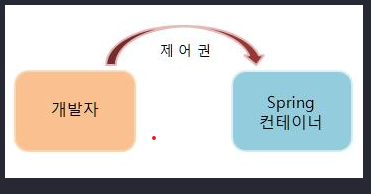
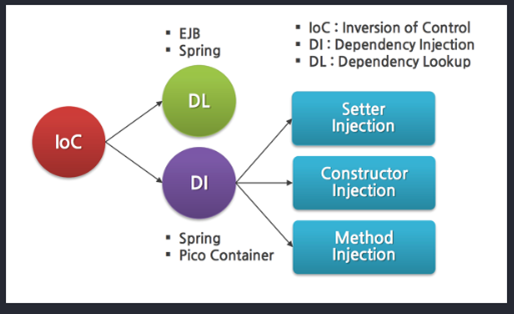
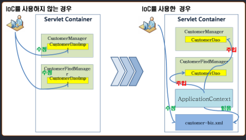
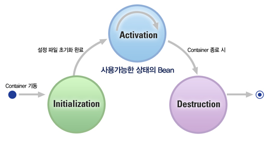
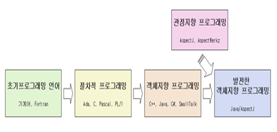
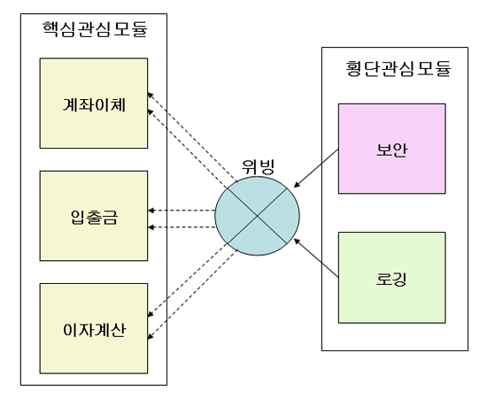
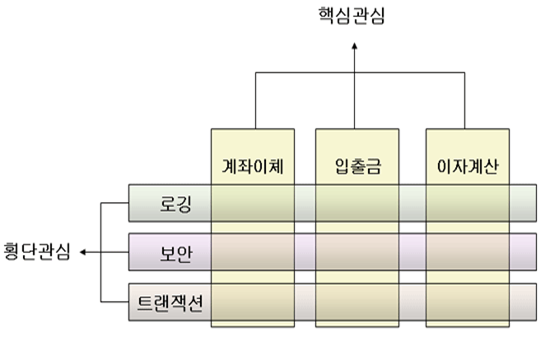
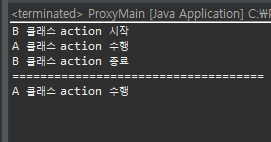
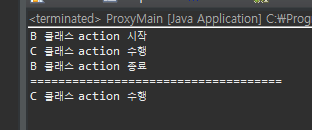
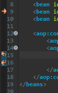

# 2020-02-03

---

IoC 기능 지원 - Spring Setter DI

IOC 기능 - DL(X)( 잘 사용하지 않음)/ DI(O) - (1.<i>setter(더많이 사용.)</i> DI 2. constructor DI)

## 스프링 관리기능.

* spring은 객체를 생성-관리-소멸하여 객체의 라이프 사이클을 관리한다.
* 객체간의 의존성(dependency)을 표현할 때 결합도(coupling)을 낮춘다.
* IOC/DI
* XML 태그 설정 / 자바 ANNOTATION 설정.










|        종류         |            위치            |
| :-----------------: | :------------------------: |
| @Service(“bean id”) |          클래스위          |
|   @Repository(“”)   |          클래스위          |
|   @Component(“”)    |          클래스위          |
|     @Autowired      | 멤버변수나 생성자 setter위 |

* @Qualifier("b2") : 같은 class중 이름이 "b2"인 class를 우선으로 받아옴. @Autowired와 같이 사용해야함
* @Resource("name = ") : @Qualifier() + @Autowired() 합쳐진 것.

---

## 구조

* main - service - dao(jdbc) - vo < - > db
* main - service - dao(파일입출력) - vo < - > 파일
* Service는 interface로 만든후 기능에 따라 implements를 이용하여 사용.

* servlet,jsp  -  service - dao(jdbc) - vo < - > db : 코드는 변경없이 실행환경만 변경이 됨.

---

##  AOP (Aspect Oriented Programming)

* aspect : 모든 스프링 클래스 공통 규현 사항들. (반복적 코딩 필요 - 1번 정의 - 필요한 클래스에 연결/ 해제)
* 여러 JAVA Framework중 Spring 만 갖고있는 유일한 용어.







* 위빙 : 연결 해주는 기능. (XML로 설정) (종단관심과 횡단관심을 연결해 주는 기능.)
* 처리해야 하는 모듈 : 핵심관심모듈(종단관심)
* 공통으로들어가는 모듈 : 횡단관심모듈(공통관심모듈)

> 구현필요 사항들 : 핵심관심코드(...여러종류) = 종단관심코드.
>
> -------------------------------------------------spring 연결(weaving) --------------------------------------------
>
> 핵심관심코드 구현시 공통적, 반복적 구현 사항들. : 공통관심코드 = 횡단관심코드(=Aspect).

### 스프링 Proxy 방식 내부 구현 원리.

* 스프링 singleton 방식 : 1개의 객체만 만들어 그 객체를 공유.

> 자바개발자 디자인 패턴 23가지. - "경험상 만들어진 패턴" => 강제적으로 사용.(Spring)
>
> singleton 패턴 / factory 패턴

#### Proxy 방식 예시.

```java
package proxypattern;

public class A implements ProxyInter {

	@Override
	public void action() {
		System.out.println("A 클래스 action 수행");
	}

}
```

```java
package proxypattern;

public class B implements ProxyInter {

	ProxyInter p;
	
	public void setP(ProxyInter p) {
		this.p = p;
	}

	@Override
	public void action() {
		System.out.println("B 클래스 action 시작");
		p.action();
		System.out.println("B 클래스 action 종료");
	}

}
```


```java
package proxypattern;

public class ProxyMain {

	public static void main(String[] args) {
		ProxyInter p = new A();
		B b1 = new B();
		b1.setP(p);
		b1.action();
		
		System.out.println("====================================");
		p.action();
	}
}
```





* B와 A모두 ProxyInter Interface를 상속받은 class.
* B클래스는 어떤 클래스든 ProxyInter를 상속받은 class로 set메소드를 수행하면 가운데 "A 클래스 action 수행"이 달라짐.
* B action은 공통으로 사용됨.

#### Spring 에서 Proxy이용 

* AOP 사용하기 위해 lib가 필요함. - aspectjweaver - xxx.jar (xxx는 버전)
* pom.xml에서 수정.

```xml
		<dependency>
			<groupId>org.aspectj</groupId>
			<artifactId>aspectjweaver</artifactId>
			<version>1.9.2</version>
			<scope>runtime</scope>
		</dependency>
```

* MVN 사이트 에서 lib 찾아서 구문추가. (aspecetjwever.jar) [MVN_site](https://mvnrepository.com/)

* xml에서 Namespaces에서 aop를 check.

* AopMain

```java
package aop1;

import org.springframework.context.ApplicationContext;
import org.springframework.context.support.ClassPathXmlApplicationContext;

public class AopMain {

	public static void main(String[] args) {
		ApplicationContext factory = new ClassPathXmlApplicationContext("aop1/aop.xml");
		Member m = factory.getBean("member",Member.class);
		Board b = factory.getBean("board",Board.class);
		
		//공통관심 = 횡단관심 = aspect 클래스.
		//Common c = factory.getBean("common", Common.class); Spring이 만들예정.
		
		//호출시간
		m.login("spring");
		//호출시간
		b.inserBoard(100);
		//호출시간
		b.getList();
		//호출시간
		m.logout();
	}
}
```

* Member.class

```java
package aop1;

public class Member {
	public void login(String id) {
		System.out.println(id + " 회원님이 로그인 하셨습니다.");
	}

	public void logout() {
		System.out.println("회원님이 로그아웃 하셨습니다.");
	}
}
```

* Board.class

```java
package aop1;

import java.util.ArrayList;

public class Board {
	public int inserBoard(int seq) {
		System.out.println(seq + " 번째 게시물을 등록합니다.");
		return seq;
	}

	public ArrayList<String> getList() {
		ArrayList<String> list = new ArrayList<String>();
		list.add("1:1번게시물:스프링수업중입니다.");
		list.add("2:2번게시물:안드로이드수업중입니다.");
		list.add("3:3번게시물:하둡수업중입니다.");
		return list;
	}
}
```

* Common.class

```java
package aop1;

import java.util.Date;

public class Common {
	public void a() {
		long startTime = System.currentTimeMillis(); // 현재 시각(1/1000초 리턴)
		System.out.println("===매서드 호출시각===" + new Date(startTime));
	}

}
```

* aop.xml

```xml
<?xml version="1.0" encoding="UTF-8"?>
<beans xmlns="http://www.springframework.org/schema/beans"
	xmlns:xsi="http://www.w3.org/2001/XMLSchema-instance"
	xmlns:aop="http://www.springframework.org/schema/aop"
	xsi:schemaLocation="http://www.springframework.org/schema/beans http://www.springframework.org/schema/beans/spring-beans.xsd
		http://www.springframework.org/schema/aop http://www.springframework.org/schema/aop/spring-aop-4.3.xsd">
	
	<bean id="member" class="aop1.Member" />
	<bean id="board" class="aop1.Board" />
	<bean id="common" class="aop1.Common" />
	
	<aop:config>
		<aop:pointcut expression="execution (public * aop1.*.*(..))" id="pc"/>
		<aop:aspect id="aspect1" ref="common">
			<aop:before method="a" pointcut-ref="pc"/>
		</aop:aspect>
	</aop:config>		
</beans>

```

* pointcut 문법( 공통(a 메소드) - weaving용어 - **핵심(a + login, logout, inserBoard,getList 메소드) 연결.**)
  * 메소드 앞 또는 뒤로 공통 메소드를 집어넣는 방식.

```xml
<aop:pointcut expression="execution (public * aop1.*.*(..))" id="pc"/>
"execution (public * aop1.*.*(int))" : int 매개변수만.
"execution (public int aop1.*.*(..))" : return type int 인 메소드만.
```

* modifier 리턴타입 패키지명.클래스명.메소드(매개변수) 

> \* : 모든
>
> (..) : 모든 매개변수
>
> .. :  하위패키지 포함

* ArrayList와 같은 콜랙션은 패키지 경로까지 모두 입력해야함.(java.lang. 패키지 이외의 것들 모두 동일.)

```xml
<aop:pointcut expression="execution (public java.util.ArrayList aop1.*.*(..))" id="pc"/>
```

* modifier 표시 없는것 : 모든 modifier이란 의미. ( * 안해도됨.)

```xml
<aop:pointcut expression="execution (java.util.ArrayList aop1.*.*(..))" id="pc"/>
```

* Proxy 방식을 이용하기 위해서는 xml파일에서  aop를 사용해야한다.
* 사용 하려는 xml파일에서 Namespaces에서 aop를 체크해준다.(그전에 위에서 한것처럼 pom.xml에서 aop에 대한 설정을 해주어야 사용이 가능하다.)




* 화살표 표시  :  aop의 실행 순서를 나타내줌.(메소드 앞 or 뒤)


## AOP 주의사항

* AOP LIB 꼭 필요함.
* PointCut 문법 확인.
* 공통관심 : 핵심관심 사이 연결. pointcut-ref : 핵심관심.
* ProceedingJoinPoint 클래스
  * **대상 객체 및 호출되는 메소드에 대한 정보, 전달되는 파라미터에 대한 정보가 필요한 경우 사용한다.**


## Web 프로그램

* html
* javascript + jQuery
* Servlet + jsp
* 등등.....

Web cilen 실행 : 요청 = url, 응답 = html -> 결과화면 : 웹브라우저(html, js) 

Web server 실행 : (cgi, php, asp ...) java-> servelt, jsp 


## 웹 서버

* servlet : 클라이언트 요청 받아서 분석(ex 1. 회원가입 :id, pw, name,... 2. 1번 게시물조회) - 결과 생성 객체 생성, 메소드 호출. 
  * 브라우저에게 결과물 전달.(html-vo)

* jsp

* dao - 요청 기능 1개 수행 결과물 vo 형태로 리턴. 


### MVC패턴방식

* http 요청 -> servlet이 받음. -> 요청처리하기 위해 dao 실행. -> db연결 -> vo결과물 -> jsp 전달.
* Servlet의 역할 : Controller 역할.(교통통제) 필요 DAO설정, 결과 받아온후 해당 JSP에게 결과 전달.
* JSP 역할 : 화면에 결과물을 보여주는 역할 (View의 역할)
* DAO, VO 역할 : Model(View에 보여줄 데이터)의 역할.

* 장점 : 늘어난 요청에 따라 DAO와 JSP만 새로 작성하면 된다.
* Servlet-jsp MVC 권장.
* Spring은 MVC 강제. 반드시 사용해야함.


### Spring MVC 패턴.

* Singleton 패턴
* Proxy 패턴
* Front Controller 패턴
* MVC패턴


