# DB day2 (20.01.06)

* Oracle, MS-SQL, mysql DML 은 비슷함.
* myspl -> page 처리 쉬움. limit 사용

___

## 0. JDBC 마무리

txtNo .getText():

eclipse는 auto commit

sql developer는 commit 명령어 필요.


pstmt 메소드

setxxx(a,b) xxx:자료형 a:? 순번 b:값

getxxx(a) a: index num or filed name. 필드명 권장.

* add

```java
public void add() {
		try {
			String strNo = txtNo.getText();
			String strName = txtName.getText();
			String strMail = txtEmail.getText();
			String strPhone = txtPhone.getText();
			
//			System.out.println(strNo+", "+strName+", "+strMail+", "+strPhone);
			
//			if(strNo.length() <1|| strName.length() <1) {
//				JOptionPane.showMessageDialog(null, "번호와 이름은 필수 사항입니다. 입력요망");
//				return;
//			}// if end
			
			switch (JOptionPane.showConfirmDialog(null, "("+strNo+", "+strName+", "+strMail+", "+strPhone+")", "추가하시겠습니까? ", JOptionPane.YES_NO_OPTION)) {
			case 0: // 확인
				
				break;
			case 1:
				return;
			}// switch end
			
			
			pstmtInsert.setInt(1,Integer.parseInt(strNo));
			pstmtInsert.setString(2, strName);
			pstmtInsert.setString(3, strMail);
			pstmtInsert.setString(4, strPhone);
			
			pstmtInsert.executeUpdate(); // 실제실행. 반환값 없는경우. 있으면 Query
			
			
			
		} catch (Exception e) {
			e.printStackTrace();
		}
		
		
	} // end add()
```

* search

```java
public void search() {
		
		String strName = Util.toKor(txtName.getText());
		if(strName.length() <1) {
			JOptionPane.showMessageDialog(null, "이름은 필수 입니다.");
			return;
		}//if end
		
		try {
			
			pstmtSearchScroll.setString(1, Util.toKor(strName));
			ResultSet rsScroll = pstmtSearchScroll.executeQuery(); // 반환값이 있음. executeQuery() - select 구문
			
			pstmtSearch.setString(1, Util.toKor(strName));
			ResultSet rs = pstmtSearch.executeQuery(); // 반환값이 있음. executeQuery() - select 구문
			
			if(model == null) model = new MyModel();
			model.getRowCount(rsScroll);
			model.setData(rs);
			table.setModel(model);
			table.updateUI();
			
		} catch (Exception e) {
			e.printStackTrace();
		}
	}// end search()
		

```

* delete

```java
	public void del() {
		total();
		String strName = null;
		try {
			
			
			strName = Util.toKor(txtName.getText());
			if(strName.length() <1) {
				JOptionPane.showMessageDialog(null, "이름은 필수 입니다.");
				return;
			}//if end
			
			switch (JOptionPane.showConfirmDialog(null, "("+strName+")", "삭제하시겠습니까?", JOptionPane.YES_NO_OPTION)) {
			case 0://확인
				break;
			case 1:
				return;
			}
			
			pstmtDelete.setString(1, strName);
			pstmtDelete.executeUpdate();
		} catch (Exception e) {
			e.printStackTrace();
		}// try end
//		JOptionPane.showMessageDialog(null, "삭제 성공");
		total();
	}// end del()	
```

## 1. 오라클 상태확인

작업관리자 -> 서비스탭 -> Oracle

프로세서 - cpu 

프로세스 - software


Listener -> 서버

ServuceXE ->  켜져야 콘솔모드로 가능.

Agent - > 안될때 커보기

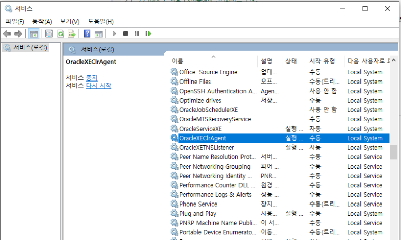

수동,자동 실행가능.

---

## 2. Memory 구조

* java로는 시스템 프로그램 하기힘듬.

* Memory 논리적인 개념. 

  * RAM

    * cpu 거리차에 속도차가 있음.

    * 스텍구조를 갖는다.

    * const(static)영역, heap영역, stack영역 

      상수영역  :  static 선언한 변수. -> 응용프로그램 닫기 전 까지 살아있음.

      stack영역 : 일시적인 변수들. 사용하고 사라짐(for문안에 int i) 블록 닫히면 지워짐.

      heap영역 : 동적 memory 

      ​	c/c++	할당 : malloc()  / new  ->c++에선 

      ​			 	해제 : delete()

      ​	Java	  할당 : new

      ​			 	해제 : gc가 알아서 함.

      ​				배열도 heap 에 포함(java에서)

      class Point{

      ​	int x,y;

      }

      Point pt = new Point();

      pt : object (인스턴스) : 4바이트. (시스템크기 따라감.) 주소를 가르키는 참조 변수.

      

       

      

  

  

  

  * ROM
    * 키보드, 마우스 연결 단자.
    * 기능이 셋팅되어 있음. 

---

## 3. 웹 - HTML5, CSS, JS, jQuery

### [최초의 웹](http://info.cern.ch/)


* Client : 서비스 요청하는 사람. request.
* Server : 서비스 제공. response.

http://www.naver.com/~~~~ : page요청 

### 프론트엔드 백엔드

* 프론트 : 사용자가 직접 받아쓰는 UI단.(htmp, css, js) : Client Side Script
  * 해석 : 브라우져.
  * 보안이 취약함
* 백엔드 : JSP, Servlet, database연동 Server용(Java, Python) : Server Side Script
  * 보안가능.  aspx, php, .net등..
  * 해석 : jsp : Tomcat, asp : IIS, php : apache ||해석 후 내용만 내보냄.


### 웹

```
1. 문서구조 : HTML

2. 디자인 : CSS

3. 기능, 동작 : Javascript(JS)

단독으로 쓰지 않는다. HTML안에서 작동.
tag를 이용.<> </> 한쌍으로 되어있음. 정적 tag
<html>
	<head>
		<title>Test</test>
	</head>
	<body>
		<input />
	</body>
</html>

xml : 유저가 만든 tag

css, js는 head테그 안에 직접 입력. 또는 script tag를 이용해서 이벤트 추가.
복잡도가 증가될시 파일로 따로 넣어서 링크로 불러 사용.


css : style tag <style> </style>

javascipt : script tag <script> </script>
```


[W3school](https://www.w3schools.com/)

https://www.w3.org/

HTML 4.x		-정적인 page

  ----> DHTML, XHTML1.x 

HTML5			판도가 바뀜. 동적인 page

---

## Eclipse에서 web작업

### Danymic Web Project 이용

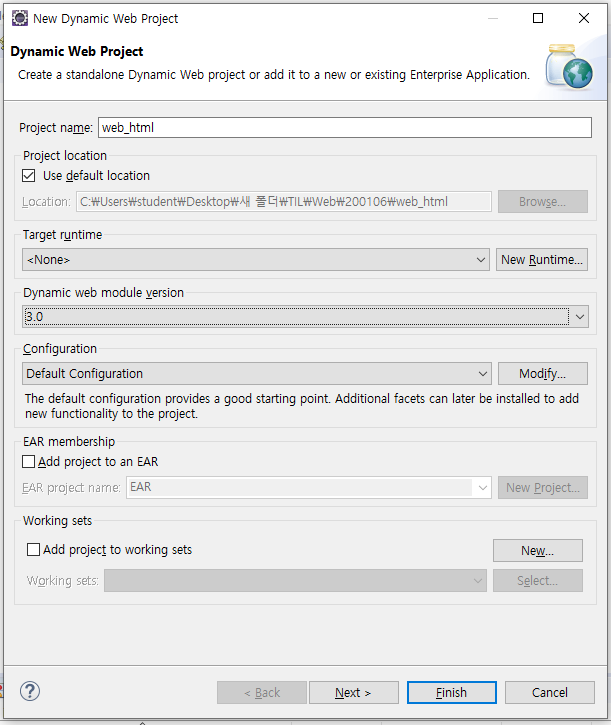

* Target runtime -> 서버 만드는것. (나중에 해도됨.)
* Dynamic web module version -> servlet 버전.

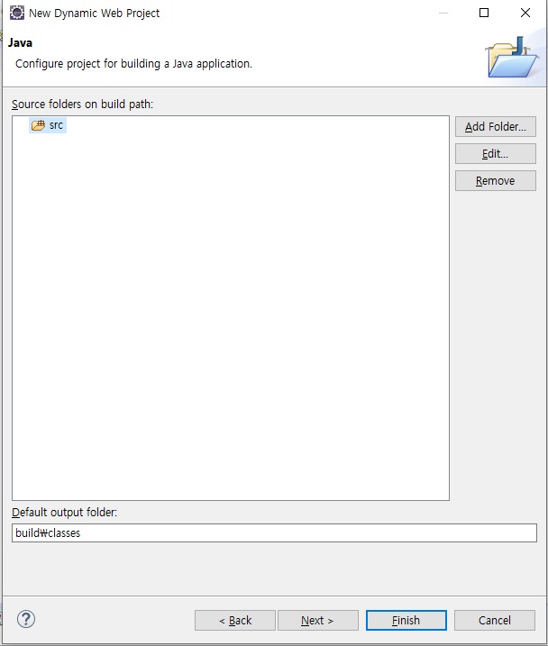


* src : .java파일들. 만들면 .class파일 생성.

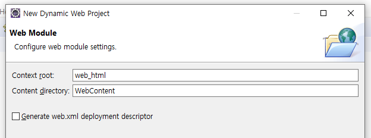

* root : 주소줄에 들어가는것.
* directory : 

* web.xml default 7.0
* .xml -> Spring , 등등 xml 오타 있으면 절대 실행X.
* JSP/servlet 꼭필요함.

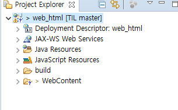

* WebContent : html, css, javascript.

* Java Resources : Servlet 저장.

  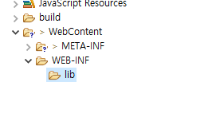

* WEB-INF\lib : 앞으로 넣을것.
* web.xml 위에 공백 있으면 안됨.

---

### 서버다운로드

[Apache](http://apache.org/)

[tomcat8 다운로드](https://tomcat.apache.org/download-80.cgi)

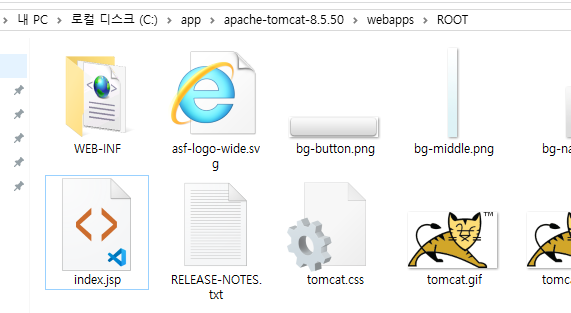

* 웹서버.(index.jsp)
* 서버구동 :C:\app\apache-tomcat-8.5.50\bin\startup


#### tomcat 과 oracle 충돌 방지

sqldeveloper에서 admin 계정 접속(system)

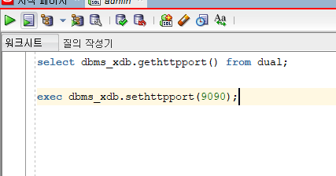


### Server eclipse에서 설정.

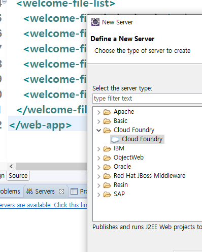

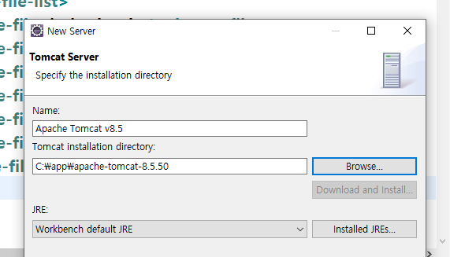


지울때.

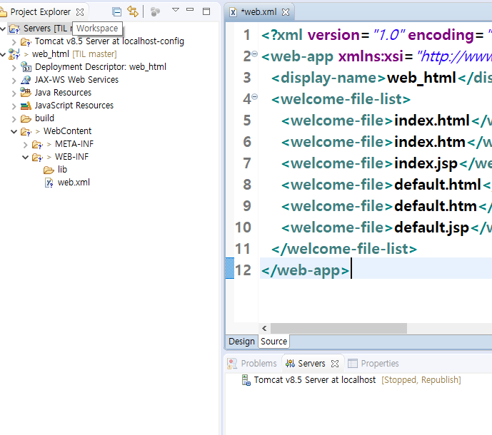

* 아래 서버와 왼쪽 위 Servers[TIL master] 둘다 지우기.


#### 언어 환경바꾸기

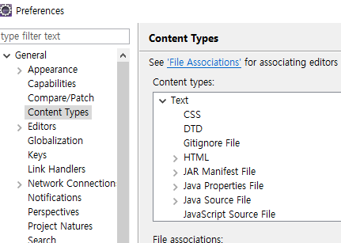

UTF-8로 변경.

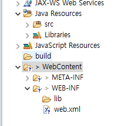

보안까지 생각하면 WEB-INF 밑으로 설정.

---

### jsp 설정

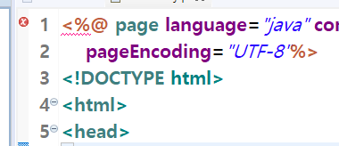


```html
<%@ page language="java" contentType="text/html; charset=UTF-8"
    pageEncoding="UTF-8"%> 
<!DOCTYPE html>
<html>
<head>
<meta charset="UTF-8">
<title>Insert title here</title>
</head>
<body>

</body>
</html>
```


<%@ %> 오류있을때..

C:\app\apache-tomcat-8.5.50\lib 에서.

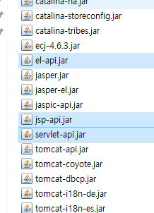

위에 3개 파일을 java파일로 옮김.

[장소](C:\Program Files\Java\jre1.8.0_231\lib\ext)

C:\Program Files\Java\jre1.8.0_231\lib\ext

---

#### 크롬으로 출력하기.

Window - Webbrowser 탭에서 chrome 선택.

chrome으로 개발자툴 사용가능 (F11)

```javascript
<%@ page language="java" contentType="text/html; charset=UTF-8"
    pageEncoding="UTF-8"%>
    <%@ page import="java.util.*" %>
<!DOCTYPE html>
<html>
<head>
<meta charset="UTF-8">
<title>Insert title here</title>
</head>
<body>
<h1>Server Test 입니다. 수정했어요.</h1>
<% Date today = new Date(); %>
<%= today %>
</body>
</html>
```


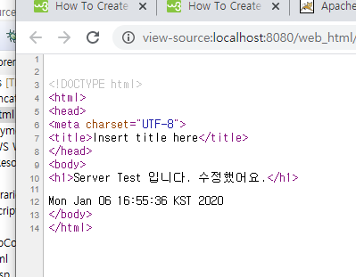

Server Side Script로 컴파일 된 상태의 내용만 보여짐.